LLMs in Social Services: Replication Materials
================
2026-05-08

- [Load Data](#load-data)
- [Figure 1](#figure-1)
  - [Figure 1a](#figure-1a)
  - [Figure 1b](#figure-1b)
    - [Figure 9](#figure-9)
- [Figure 3](#figure-3)
  - [Figure 3: Accuracy by difficulty](#figure-3-accuracy-by-difficulty)
- [Figure 4](#figure-4)
  - [Duration by question position](#duration-by-question-position)
- [Table 1: treatment effects](#table-1-treatment-effects)
- [Tables 2-4](#tables-2-4)
- [Table 5](#table-5)
- [Table 6](#table-6)
- [Table 7](#table-7)
- [Tables 8-9:](#tables-8-9)
- [Figures 10-11](#figures-10-11)
- [Figure 11](#figure-11)
- [Figures 13-14](#figures-13-14)
- [Figure 15](#figure-15)
- [Figure 16: accuracy by question
  position](#figure-16-accuracy-by-question-position)
- [Figure 17](#figure-17)
- [Regression Tables](#regression-tables)
  - [Tables 15-20](#tables-15-20)
    - [Simple linear models](#simple-linear-models)
    - [Generalized linear models](#generalized-linear-models)

This notebooks replicates all of the figures in the main text, and many
of the figures and tables from the SI. For each plot and table, we
typically produce a version with all participants and a version only for
those who pass the attention check.

**Initialize functions for plotting**

**Initialize functions for models**

## Load Data

# Figure 1

## Figure 1a

    ## [1] 125

    ## 
    ## Call:
    ## lm(formula = respondent_accuracy ~ experiment_type, data = df)
    ## 
    ## Residuals:
    ##     Min      1Q  Median      3Q     Max 
    ## -50.426  -9.032   0.686   9.574  29.574 
    ## 
    ## Coefficients:
    ##                          Estimate Std. Error t value Pr(>|t|)    
    ## (Intercept)                49.032      2.766  17.726  < 2e-16 ***
    ## experiment_typetreatment   21.393      3.190   6.707 6.44e-10 ***
    ## ---
    ## Signif. codes:  0 '***' 0.001 '**' 0.01 '*' 0.05 '.' 0.1 ' ' 1
    ## 
    ## Residual standard error: 15.4 on 123 degrees of freedom
    ## Multiple R-squared:  0.2678, Adjusted R-squared:  0.2618 
    ## F-statistic: 44.98 on 1 and 123 DF,  p-value: 6.439e-10

    ## 
    ## Call:
    ## lm(formula = respondent_accuracy ~ experiment_type + chatbot_accuracy:experiment_type, 
    ##     data = df)
    ## 
    ## Residuals:
    ##     Min      1Q  Median      3Q     Max 
    ## -58.217  -5.850   2.654   8.746  28.746 
    ## 
    ## Coefficients: (1 not defined because of singularities)
    ##                                            Estimate Std. Error t value Pr(>|t|)
    ## (Intercept)                                49.03226    2.39911  20.438  < 2e-16
    ## experiment_typetreatment                  -27.34722    8.05496  -3.395 0.000926
    ## experiment_typecontrol:chatbot_accuracy          NA         NA      NA       NA
    ## experiment_typetreatment:chatbot_accuracy   0.56532    0.08774   6.443 2.44e-09
    ##                                              
    ## (Intercept)                               ***
    ## experiment_typetreatment                  ***
    ## experiment_typecontrol:chatbot_accuracy      
    ## experiment_typetreatment:chatbot_accuracy ***
    ## ---
    ## Signif. codes:  0 '***' 0.001 '**' 0.01 '*' 0.05 '.' 0.1 ' ' 1
    ## 
    ## Residual standard error: 13.36 on 122 degrees of freedom
    ## Multiple R-squared:  0.4537, Adjusted R-squared:  0.4447 
    ## F-statistic: 50.65 on 2 and 122 DF,  p-value: < 2.2e-16

    ## 
    ## Call:
    ## lm(formula = respondent_accuracy ~ experiment_type, data = df)
    ## 
    ## Residuals:
    ##     Min      1Q  Median      3Q     Max 
    ## -51.786  -8.888   1.548   9.325  27.343 
    ## 
    ## Coefficients:
    ##                          Estimate Std. Error t value Pr(>|t|)    
    ## (Intercept)                50.435      3.021  16.695  < 2e-16 ***
    ## experiment_typetreatment   21.351      3.588   5.951 7.43e-08 ***
    ## ---
    ## Signif. codes:  0 '***' 0.001 '**' 0.01 '*' 0.05 '.' 0.1 ' ' 1
    ## 
    ## Residual standard error: 14.49 on 77 degrees of freedom
    ## Multiple R-squared:  0.315,  Adjusted R-squared:  0.3061 
    ## F-statistic: 35.41 on 1 and 77 DF,  p-value: 7.425e-08

    ## 
    ## Call:
    ## lm(formula = respondent_accuracy ~ experiment_type + chatbot_accuracy:experiment_type, 
    ##     data = df)
    ## 
    ## Residuals:
    ##     Min      1Q  Median      3Q     Max 
    ## -58.984  -5.593   2.643   7.912  27.343 
    ## 
    ## Coefficients: (1 not defined because of singularities)
    ##                                           Estimate Std. Error t value Pr(>|t|)
    ## (Intercept)                                50.4348     2.6920  18.735  < 2e-16
    ## experiment_typetreatment                  -24.0279    10.4142  -2.307   0.0238
    ## experiment_typecontrol:chatbot_accuracy         NA         NA      NA       NA
    ## experiment_typetreatment:chatbot_accuracy   0.5258     0.1148   4.579  1.8e-05
    ##                                              
    ## (Intercept)                               ***
    ## experiment_typetreatment                  *  
    ## experiment_typecontrol:chatbot_accuracy      
    ## experiment_typetreatment:chatbot_accuracy ***
    ## ---
    ## Signif. codes:  0 '***' 0.001 '**' 0.01 '*' 0.05 '.' 0.1 ' ' 1
    ## 
    ## Residual standard error: 12.91 on 76 degrees of freedom
    ## Multiple R-squared:  0.4631, Adjusted R-squared:  0.449 
    ## F-statistic: 32.78 on 2 and 76 DF,  p-value: 5.444e-11

    ## respondent_accuracy ~ experiment_label
    ## <environment: 0x7c261a2e0>
    ## 
    ## Call:
    ## lm(formula = full_formula, data = df)
    ## 
    ## Residuals:
    ##     Min      1Q  Median      3Q     Max 
    ## -56.296  -6.810   2.079   9.020  28.746 
    ## 
    ## Coefficients:
    ##                                         Estimate Std. Error t value Pr(>|t|)
    ## (Intercept)                               49.032      2.458  19.947  < 2e-16
    ## experiment_labelLow\n53-73% accurate       8.062      3.640   2.215   0.0286
    ## experiment_labelMedium\n80-93% accurate   24.170      4.130   5.852 4.25e-08
    ## experiment_labelHigh\n96-100% accurate    27.264      3.117   8.747 1.53e-14
    ##                                            
    ## (Intercept)                             ***
    ## experiment_labelLow\n53-73% accurate    *  
    ## experiment_labelMedium\n80-93% accurate ***
    ## experiment_labelHigh\n96-100% accurate  ***
    ## ---
    ## Signif. codes:  0 '***' 0.001 '**' 0.01 '*' 0.05 '.' 0.1 ' ' 1
    ## 
    ## Residual standard error: 13.69 on 121 degrees of freedom
    ## Multiple R-squared:  0.4312, Adjusted R-squared:  0.4171 
    ## F-statistic: 30.57 on 3 and 121 DF,  p-value: 8.81e-15

    ## respondent_accuracy ~ experiment_label
    ## <environment: 0x7c23cae08>
    ## 
    ## Call:
    ## lm(formula = full_formula, data = df)
    ## 
    ## Residuals:
    ##     Min      1Q  Median      3Q     Max 
    ## -56.552  -5.220   1.226   7.893  27.343 
    ## 
    ## Coefficients:
    ##                                         Estimate Std. Error t value Pr(>|t|)
    ## (Intercept)                               50.435      2.731  18.465  < 2e-16
    ## experiment_labelLow\n53-73% accurate       8.676      4.347   1.996   0.0496
    ## experiment_labelMedium\n80-93% accurate   25.676      4.665   5.505 4.95e-07
    ## experiment_labelHigh\n96-100% accurate    26.117      3.657   7.141 5.05e-10
    ##                                            
    ## (Intercept)                             ***
    ## experiment_labelLow\n53-73% accurate    *  
    ## experiment_labelMedium\n80-93% accurate ***
    ## experiment_labelHigh\n96-100% accurate  ***
    ## ---
    ## Signif. codes:  0 '***' 0.001 '**' 0.01 '*' 0.05 '.' 0.1 ' ' 1
    ## 
    ## Residual standard error: 13.1 on 75 degrees of freedom
    ## Multiple R-squared:  0.4546, Adjusted R-squared:  0.4328 
    ## F-statistic: 20.84 on 3 and 75 DF,  p-value: 6.408e-10

    ## 
    ## ======================================================================================================================================================================================
    ##                                                                                                       Dependent variable:                                                             
    ##                                           --------------------------------------------------------------------------------------------------------------------------------------------
    ##                                                                                                       respondent_accuracy                                                             
    ##                                                     (1)                     (2)                     (3)                    (4)                    (5)                    (6)          
    ## --------------------------------------------------------------------------------------------------------------------------------------------------------------------------------------
    ## experiment_typetreatment                         21.393***                                      -27.347***              21.351***                                      -24.028*       
    ##                                                   (2.443)                                         (6.974)                (2.963)                                       (10.188)       
    ##                                                                                                                                                                                       
    ## 53-73% accurate                                                           8.062**                                                                8.676*                               
    ##                                                                           (2.906)                                                               (3.514)                               
    ##                                                                                                                                                                                       
    ## 80-93% accurate                                                          24.170***                                                             25.676***                              
    ##                                                                           (3.249)                                                               (3.290)                               
    ##                                                                                                                                                                                       
    ## 96-100% accurate                                                         27.264***                                                             26.117***                              
    ##                                                                           (2.936)                                                               (3.802)                               
    ##                                                                                                                                                                                       
    ## experiment_typecontrol:chatbot_accuracy                                                                                                                                               
    ##                                                                                                                                                                                       
    ##                                                                                                                                                                                       
    ## experiment_typetreatment:chatbot_accuracy                                                        0.565***                                                              0.526***       
    ##                                                                                                   (0.085)                                                              (0.124)        
    ##                                                                                                                                                                                       
    ## Constant                                         49.032***               49.032***               49.032***              50.435***              50.435***              50.435***       
    ##                                                   (1.713)                 (1.727)                 (1.720)                (2.050)                (2.077)                (2.064)        
    ##                                                                                                                                                                                       
    ## --------------------------------------------------------------------------------------------------------------------------------------------------------------------------------------
    ## Observations                                        125                     125                     125                     79                     79                     79          
    ## R2                                                 0.268                   0.431                   0.454                  0.315                  0.455                  0.463         
    ## Adjusted R2                                        0.262                   0.417                   0.445                  0.306                  0.433                  0.449         
    ## Residual Std. Error                          15.401 (df = 123)       13.686 (df = 121)       13.358 (df = 122)       14.488 (df = 77)       13.099 (df = 75)       12.910 (df = 76)   
    ## F Statistic                               44.981*** (df = 1; 123) 30.571*** (df = 3; 121) 50.654*** (df = 2; 122) 35.410*** (df = 1; 77) 20.836*** (df = 3; 75) 32.777*** (df = 2; 76)
    ## ======================================================================================================================================================================================
    ## Note:                                                                                                                                                    *p<0.05; **p<0.01; ***p<0.001

Produce effect size plots:

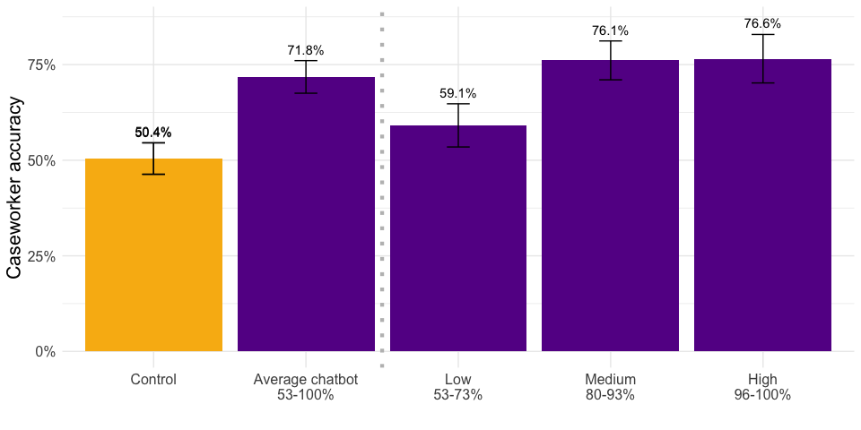<!-- -->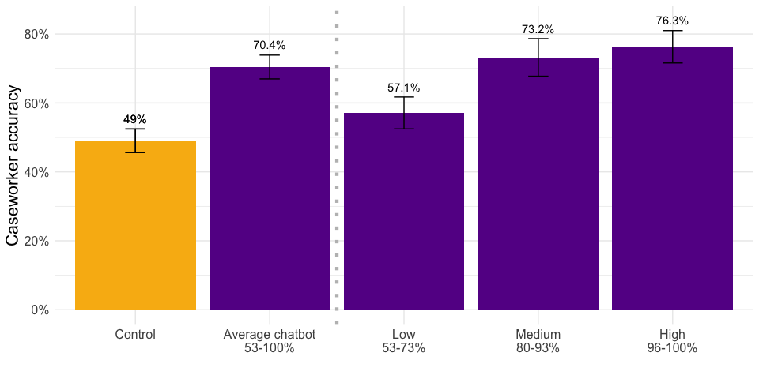<!-- -->

## Figure 1b

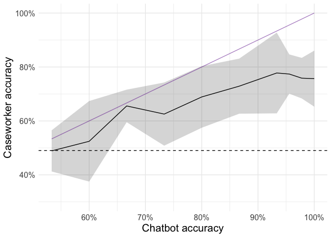<!-- -->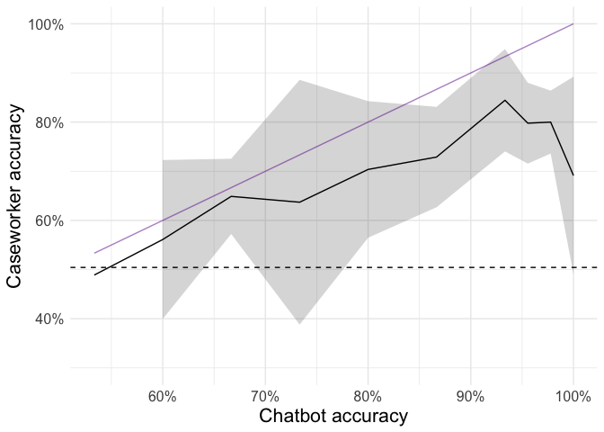<!-- -->

    ## # A tibble: 9 × 5
    ##      id num_incorrect passed_attention experiment_type respondent_accuracy
    ##   <dbl>         <dbl> <chr>            <chr>                         <dbl>
    ## 1   107             0 Passed attention treatment                      20  
    ## 2     1             0 Passed attention treatment                      48.9
    ## 3   124             0 Passed attention treatment                      51.1
    ## 4    52             0 Passed attention treatment                      60  
    ## 5    80             0 Passed attention treatment                      73.3
    ## 6    74             0 Passed attention treatment                      86.7
    ## 7    56             0 Passed attention treatment                      88.9
    ## 8    44             0 Passed attention treatment                      95.6
    ## 9    51             0 Passed attention treatment                      97.8

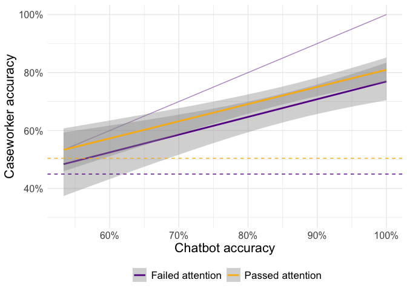<!-- -->

### Figure 9

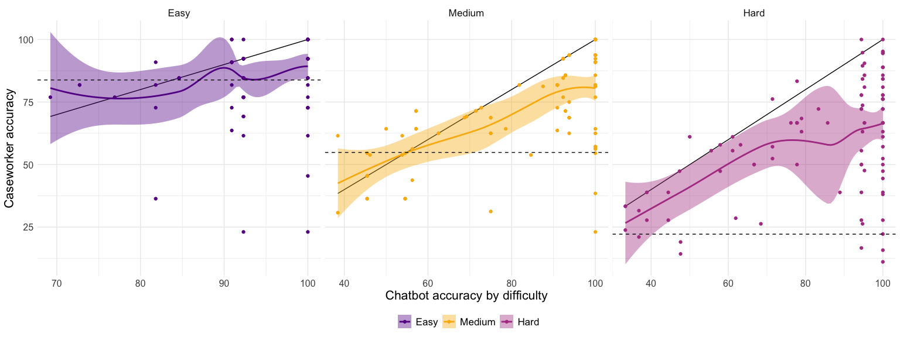<!-- -->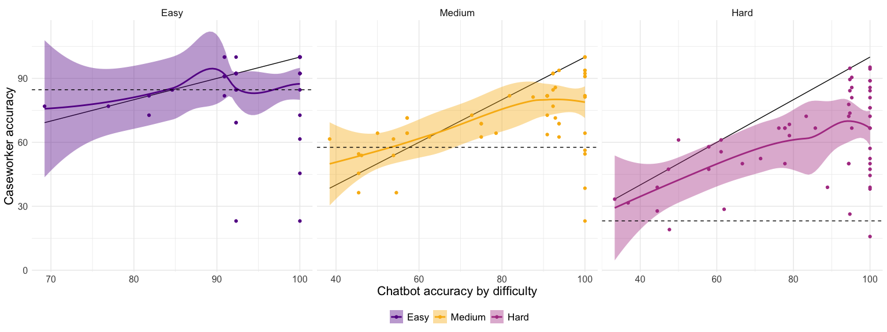<!-- -->

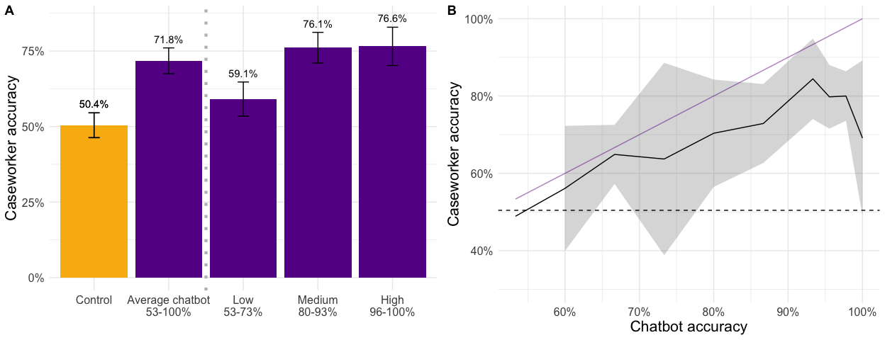<!-- -->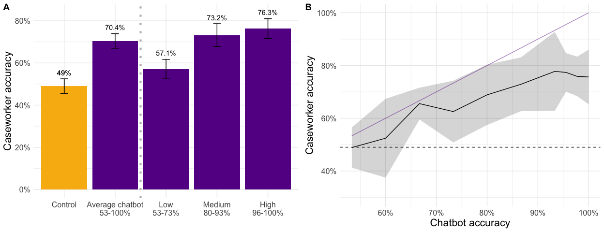<!-- -->

# Figure 3

## Figure 3: Accuracy by difficulty

**Passing attention check**

    ## 
    ## Call:
    ## lm(formula = respondent_correct ~ llm_suggestion + llm_incorrect, 
    ##     data = df)
    ## 
    ## Coefficients:
    ##    (Intercept)  llm_suggestion   llm_incorrect  
    ##         0.3902          0.3422         -0.5266

    ##   llm_suggestion llm_incorrect       fit       lwr       upr
    ## 1              0             0 0.3901996 0.3448797 0.4355195
    ## 2              1             0 0.7323944 0.6763256 0.7884632
    ## 3              1             1 0.2057971 0.1555712 0.2560230

    ## # A tibble: 3 × 6
    ##   difficulty_recoded Control Correct Incorrect diff_correct diff_incorrect
    ##   <fct>                <dbl>   <dbl>     <dbl>        <dbl>          <dbl>
    ## 1 1                    0.787   0.879     0.239       0.0916        -0.548 
    ## 2 2                    0.561   0.794     0.276       0.233         -0.285 
    ## 3 3                    0.229   0.682     0.145       0.454         -0.0832

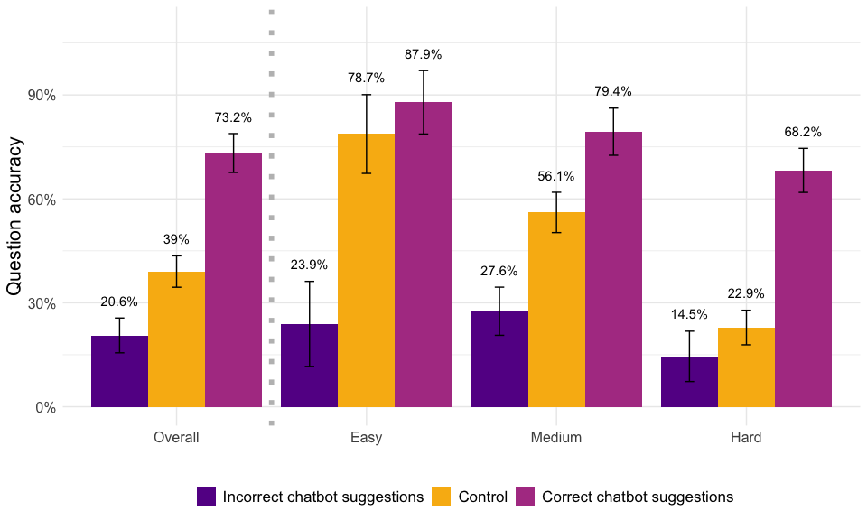<!-- -->

**Not passing attention check**

    ## 
    ## Call:
    ## lm(formula = respondent_correct ~ llm_suggestion + llm_incorrect, 
    ##     data = df)
    ## 
    ## Coefficients:
    ##    (Intercept)  llm_suggestion   llm_incorrect  
    ##         0.3804          0.3485         -0.5436

    ##   llm_suggestion llm_incorrect       fit       lwr       upr
    ## 1              0             0 0.3803763 0.3454602 0.4152925
    ## 2              1             0 0.7288542 0.7074945 0.7502139
    ## 3              1             1 0.1852487 0.1536843 0.2168131

    ## # A tibble: 3 × 6
    ##   difficulty_recoded Control Correct Incorrect diff_correct diff_incorrect
    ##   <fct>                <dbl>   <dbl>     <dbl>        <dbl>          <dbl>
    ## 1 1                    0.750   0.854     0.297        0.104        -0.453 
    ## 2 2                    0.539   0.791     0.222        0.252        -0.317 
    ## 3 3                    0.224   0.677     0.132        0.453        -0.0914

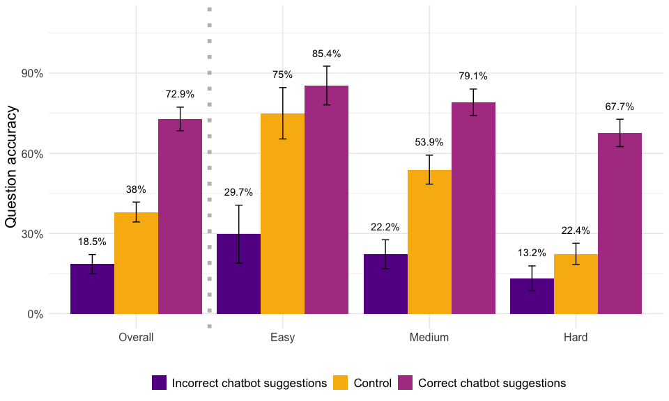<!-- -->

# Figure 4

## Duration by question position

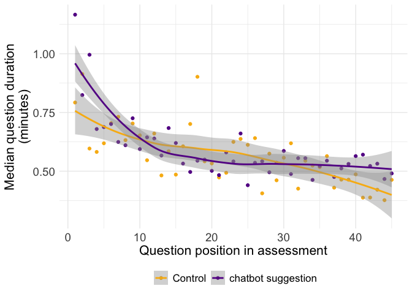<!-- -->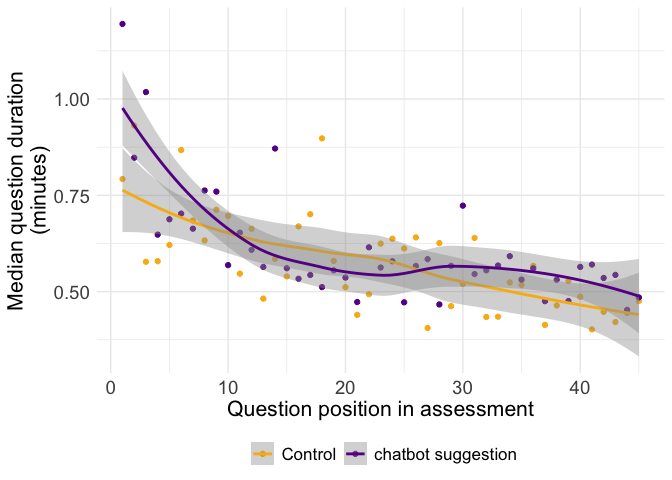<!-- -->

# Table 1: treatment effects

    ## 
    ## ========================================================================
    ##                                        Dependent variable:              
    ##                          -----------------------------------------------
    ##                                        respondent_accuracy              
    ##                                    (1)                     (2)          
    ## ------------------------------------------------------------------------
    ## experiment_typetreatment        21.393***                               
    ##                                  (2.443)                                
    ##                                                                         
    ## 53-73% accurate                                          8.062**        
    ##                                                          (2.906)        
    ##                                                                         
    ## 80-93% accurate                                         24.170***       
    ##                                                          (3.249)        
    ##                                                                         
    ## 96-100% accurate                                        27.264***       
    ##                                                          (2.936)        
    ##                                                                         
    ## Constant                        49.032***               49.032***       
    ##                                  (1.713)                 (1.727)        
    ##                                                                         
    ## ------------------------------------------------------------------------
    ## Observations                       125                     125          
    ## R2                                0.268                   0.431         
    ## Adjusted R2                       0.262                   0.417         
    ## Residual Std. Error         15.401 (df = 123)       13.686 (df = 121)   
    ## F Statistic              44.981*** (df = 1; 123) 30.571*** (df = 3; 121)
    ## ========================================================================
    ## Note:                                      *p<0.05; **p<0.01; ***p<0.001

# Tables 2-4

|   n | avg_overlap | pct_gt_1 | pct_all_4 |
|----:|------------:|---------:|----------:|
|  89 |        2.02 |     0.54 |      0.18 |

| name | value | total | A | B | C | D |
|:---|:---|---:|---:|---:|---:|---:|
| Age | Adult (22-59) | 71 | 34 | 34 | 35 | 37 |
| Age | Senior (60+) | 63 | 27 | 29 | 31 | 29 |
| Citizenship | All U.S. Citizens | 86 | 44 | 44 | 44 | 44 |
| Citizenship | Mixed household (eligible citizens and ineligible non-citizens) | 3 | 1 | 1 | 1 | 1 |
| Disability | Not legally disabled | 54 | 27 | 26 | 28 | 28 |
| Disability | Receives SSI/RSDI | 37 | 20 | 21 | 19 | 19 |
| Employment | Employed by others | 26 | 18 | 12 | 12 | 14 |
| Employment | Not in labor force | 55 | 23 | 29 | 29 | 28 |
| Employment | Self-employed | 10 | 6 | 6 | 6 | 5 |
| Gender | Female | 73 | 36 | 34 | 34 | 32 |
| Gender | Male | 66 | 33 | 33 | 30 | 32 |

| category                                           |   A |   B |   C |   D | total |
|:---------------------------------------------------|----:|----:|----:|----:|------:|
| Child support payment deduction                    |   1 |   0 |   0 |   1 |     1 |
| Child support payments received from absent parent |   3 |   1 |   2 |   1 |     5 |
| Citizenship and noncitizenship status              |   1 |   1 |   1 |   2 |     4 |
| Combined gross income                              |   1 |   0 |   1 |   0 |     1 |
| Combined net income                                |   1 |   0 |   1 |   0 |     2 |
| Contributions                                      |   4 |   5 |   4 |   4 |     7 |
| Dependent care deduction                           |   1 |   1 |   1 |   1 |     1 |
| Medical expense deductions                         |   5 |   5 |   6 |   5 |    11 |
| Other earned income                                |   1 |   1 |   0 |   1 |     1 |
| Other unearned income                              |   1 |   1 |   2 |   2 |     3 |
| RSDI benefits                                      |   2 |   2 |   1 |   1 |     2 |
| Recipient disqualification                         |   2 |   1 |   1 |   2 |     4 |
| Reporting systems                                  |   2 |   2 |   2 |   1 |     3 |
| SSI and/or State SSI supplement                    |   4 |   2 |   3 |   3 |     5 |
| Self-employment                                    |   4 |   4 |   4 |   3 |     8 |
| Shelter deduction                                  |   2 |   3 |   3 |   2 |     5 |
| Social Security Number                             |   1 |   1 |   1 |   1 |     1 |
| Standard utility allowance                         |   2 |   5 |   3 |   4 |     7 |
| Student status                                     |   1 |   0 |   1 |   1 |     1 |
| Unit composition                                   |   1 |   2 |   2 |   2 |     5 |
| Wages and salaries                                 |   5 |   6 |   4 |   5 |     8 |
| Other government benefits                          |   0 |   1 |   1 |   2 |     2 |
| Unemployment compensation                          |   0 |   1 |   1 |   1 |     2 |

# Table 5

| languages              | n_pct_all  | n_pct_passed |
|:-----------------------|:-----------|:-------------|
| Cantonese              | 2 (1.71)   | 1 (1.35)     |
| Korean                 | 2 (1.71)   | 2 (2.7)      |
| Mandarin               | 3 (2.56)   | 2 (2.7)      |
| No                     | 24 (20.51) | 18 (24.32)   |
| Other (please specify) | 4 (3.42)   | 2 (2.7)      |
| Spanish                | 92 (78.63) | 56 (75.68)   |

# Table 6

    ## # A tibble: 4 × 5
    ##   label        median_form_all mean_form_all median_form_passed mean_form_passed
    ##   <chr>        <glue>          <glue>        <glue>             <glue>          
    ## 1 Cumulative … 50
    ## (30-80)       51.38
    ## (46.1-…  50
    ## (21.25-70)       47.77
    ## (41.28-54… 
    ## 2 Perception … 80
    ## (60-95)       75.7
    ## (70.91-…  80
    ## (70-95)          77.25
    ## (71.51-83) 
    ## 3 Often use    80
    ## (50-90)       70.04
    ## (64.56…  80
    ## (52.5-95)        73.04
    ## (66.58-79… 
    ## 4 Years exper… 3
    ## (1-5)          3.94
    ## (3.21-4…  3
    ## (1-5)             4.06
    ## (3.04-5.07)

# Table 7

<table>

<thead>

<tr>

<th style="text-align:left;">

lab
</th>

<th style="text-align:left;">

calfresh_prog_know
</th>

<th style="text-align:left;">

res
</th>

<th style="text-align:left;">

res_all
</th>

</tr>

</thead>

<tbody>

<tr>

<td style="text-align:left;vertical-align: middle !important;" rowspan="4">

Program Knowledge of CalFresh
</td>

<td style="text-align:left;">

Slightly well
</td>

<td style="text-align:left;">

23 (18.85%)
</td>

<td style="text-align:left;">

18 (23.38%)
</td>

</tr>

<tr>

<td style="text-align:left;">

Moderately well
</td>

<td style="text-align:left;">

43 (35.25%)
</td>

<td style="text-align:left;">

23 (29.87%)
</td>

</tr>

<tr>

<td style="text-align:left;">

Very well
</td>

<td style="text-align:left;">

39 (31.97%)
</td>

<td style="text-align:left;">

27 (35.06%)
</td>

</tr>

<tr>

<td style="text-align:left;">

Extremely well
</td>

<td style="text-align:left;">

17 (13.93%)
</td>

<td style="text-align:left;">

9 (11.69%)
</td>

</tr>

</tbody>

</table>

<table>

<thead>

<tr>

<th style="text-align:left;">

lab
</th>

<th style="text-align:left;">

existing_chatbot_use
</th>

<th style="text-align:left;">

res
</th>

<th style="text-align:left;">

res_all
</th>

</tr>

</thead>

<tbody>

<tr>

<td style="text-align:left;vertical-align: middle !important;" rowspan="6">

Existing Chatbot Use
</td>

<td style="text-align:left;">

Never
</td>

<td style="text-align:left;">

33 (26.61%)
</td>

<td style="text-align:left;">

19 (24.36%)
</td>

</tr>

<tr>

<td style="text-align:left;">

Once a month or less
</td>

<td style="text-align:left;">

25 (20.16%)
</td>

<td style="text-align:left;">

17 (21.79%)
</td>

</tr>

<tr>

<td style="text-align:left;">

A couple times a month
</td>

<td style="text-align:left;">

24 (19.35%)
</td>

<td style="text-align:left;">

15 (19.23%)
</td>

</tr>

<tr>

<td style="text-align:left;">

At least once a week
</td>

<td style="text-align:left;">

22 (17.74%)
</td>

<td style="text-align:left;">

13 (16.67%)
</td>

</tr>

<tr>

<td style="text-align:left;">

About once a day
</td>

<td style="text-align:left;">

12 (9.68%)
</td>

<td style="text-align:left;">

8 (10.26%)
</td>

</tr>

<tr>

<td style="text-align:left;">

More than once a day
</td>

<td style="text-align:left;">

8 (6.45%)
</td>

<td style="text-align:left;">

6 (7.69%)
</td>

</tr>

</tbody>

</table>

<table>

<thead>

<tr>

<th style="text-align:left;">

lab
</th>

<th style="text-align:left;">

base_chatbot_benharm
</th>

<th style="text-align:left;">

res
</th>

<th style="text-align:left;">

res_all
</th>

</tr>

</thead>

<tbody>

<tr>

<td style="text-align:left;vertical-align: middle !important;" rowspan="3">

Whether chatbots are beneficial or harmful
</td>

<td style="text-align:left;">

More harm than benefit
</td>

<td style="text-align:left;">

7 (5.65%)
</td>

<td style="text-align:left;">

4 (5.13%)
</td>

</tr>

<tr>

<td style="text-align:left;">

About an equal mix of benefit and harm
</td>

<td style="text-align:left;">

61 (49.19%)
</td>

<td style="text-align:left;">

34 (43.59%)
</td>

</tr>

<tr>

<td style="text-align:left;">

More benefit than harm
</td>

<td style="text-align:left;">

56 (45.16%)
</td>

<td style="text-align:left;">

40 (51.28%)
</td>

</tr>

</tbody>

</table>

<table>

<thead>

<tr>

<th style="text-align:left;">

lab
</th>

<th style="text-align:left;">

base_chatbot_views
</th>

<th style="text-align:left;">

res
</th>

<th style="text-align:left;">

res_all
</th>

</tr>

</thead>

<tbody>

<tr>

<td style="text-align:left;vertical-align: middle !important;" rowspan="5">

Views on chatbots
</td>

<td style="text-align:left;">

Very negative
</td>

<td style="text-align:left;">

4 (3.23%)
</td>

<td style="text-align:left;">

3 (3.85%)
</td>

</tr>

<tr>

<td style="text-align:left;">

Somewhat negative
</td>

<td style="text-align:left;">

9 (7.26%)
</td>

<td style="text-align:left;">

7 (8.97%)
</td>

</tr>

<tr>

<td style="text-align:left;">

Neither positive nor negative
</td>

<td style="text-align:left;">

45 (36.29%)
</td>

<td style="text-align:left;">

27 (34.62%)
</td>

</tr>

<tr>

<td style="text-align:left;">

Somewhat positive
</td>

<td style="text-align:left;">

45 (36.29%)
</td>

<td style="text-align:left;">

27 (34.62%)
</td>

</tr>

<tr>

<td style="text-align:left;">

Very positive
</td>

<td style="text-align:left;">

21 (16.94%)
</td>

<td style="text-align:left;">

14 (17.95%)
</td>

</tr>

</tbody>

</table>

<table>

<thead>

<tr>

<th style="text-align:left;">

lab
</th>

<th style="text-align:left;">

learning_questions
</th>

<th style="text-align:left;">

res
</th>

<th style="text-align:left;">

res_all
</th>

</tr>

</thead>

<tbody>

<tr>

<td style="text-align:left;vertical-align: middle !important;" rowspan="4">

How easy or difficult to find answers to questions
</td>

<td style="text-align:left;">

Somewhat difficult
</td>

<td style="text-align:left;">

24 (19.51%)
</td>

<td style="text-align:left;">

22 (28.21%)
</td>

</tr>

<tr>

<td style="text-align:left;">

Neither easy nor difficult
</td>

<td style="text-align:left;">

37 (30.08%)
</td>

<td style="text-align:left;">

20 (25.64%)
</td>

</tr>

<tr>

<td style="text-align:left;">

Somewhat easy
</td>

<td style="text-align:left;">

41 (33.33%)
</td>

<td style="text-align:left;">

22 (28.21%)
</td>

</tr>

<tr>

<td style="text-align:left;">

Very easy
</td>

<td style="text-align:left;">

21 (17.07%)
</td>

<td style="text-align:left;">

14 (17.95%)
</td>

</tr>

</tbody>

</table>

<table>

<thead>

<tr>

<th style="text-align:left;">

lab
</th>

<th style="text-align:left;">

often_difficulty_qs
</th>

<th style="text-align:left;">

res
</th>

<th style="text-align:left;">

res_all
</th>

</tr>

</thead>

<tbody>

<tr>

<td style="text-align:left;vertical-align: middle !important;" rowspan="5">

How often you run into questions that you do not know the answer to
</td>

<td style="text-align:left;">

Once a month or less
</td>

<td style="text-align:left;">

28 (22.76%)
</td>

<td style="text-align:left;">

18 (23.08%)
</td>

</tr>

<tr>

<td style="text-align:left;">

A couple times a month
</td>

<td style="text-align:left;">

36 (29.27%)
</td>

<td style="text-align:left;">

26 (33.33%)
</td>

</tr>

<tr>

<td style="text-align:left;">

At least once a week
</td>

<td style="text-align:left;">

37 (30.08%)
</td>

<td style="text-align:left;">

22 (28.21%)
</td>

</tr>

<tr>

<td style="text-align:left;">

About once a day
</td>

<td style="text-align:left;">

11 (8.94%)
</td>

<td style="text-align:left;">

7 (8.97%)
</td>

</tr>

<tr>

<td style="text-align:left;">

More than once a day
</td>

<td style="text-align:left;">

11 (8.94%)
</td>

<td style="text-align:left;">

5 (6.41%)
</td>

</tr>

</tbody>

</table>

<table>

<thead>

<tr>

<th style="text-align:left;">

lab
</th>

<th style="text-align:left;">

sources_google
</th>

<th style="text-align:left;">

res
</th>

<th style="text-align:left;">

res_all
</th>

</tr>

</thead>

<tbody>

<tr>

<td style="text-align:left;vertical-align: middle !important;" rowspan="6">

How often do you use: Google
</td>

<td style="text-align:left;">

Never
</td>

<td style="text-align:left;">

2 (1.63%)
</td>

<td style="text-align:left;">

1 (1.28%)
</td>

</tr>

<tr>

<td style="text-align:left;">

Once a month or less
</td>

<td style="text-align:left;">

9 (7.32%)
</td>

<td style="text-align:left;">

4 (5.13%)
</td>

</tr>

<tr>

<td style="text-align:left;">

A couple times a month
</td>

<td style="text-align:left;">

18 (14.63%)
</td>

<td style="text-align:left;">

11 (14.1%)
</td>

</tr>

<tr>

<td style="text-align:left;">

At least once a week
</td>

<td style="text-align:left;">

17 (13.82%)
</td>

<td style="text-align:left;">

9 (11.54%)
</td>

</tr>

<tr>

<td style="text-align:left;">

About once a day
</td>

<td style="text-align:left;">

22 (17.89%)
</td>

<td style="text-align:left;">

13 (16.67%)
</td>

</tr>

<tr>

<td style="text-align:left;">

More than once a day
</td>

<td style="text-align:left;">

55 (44.72%)
</td>

<td style="text-align:left;">

40 (51.28%)
</td>

</tr>

</tbody>

</table>

<table>

<thead>

<tr>

<th style="text-align:left;">

lab
</th>

<th style="text-align:left;">

sources_slack_email
</th>

<th style="text-align:left;">

res
</th>

<th style="text-align:left;">

res_all
</th>

</tr>

</thead>

<tbody>

<tr>

<td style="text-align:left;vertical-align: middle !important;" rowspan="6">

How often do you use: Slack/Email
</td>

<td style="text-align:left;">

Never
</td>

<td style="text-align:left;">

8 (6.5%)
</td>

<td style="text-align:left;">

6 (7.69%)
</td>

</tr>

<tr>

<td style="text-align:left;">

Once a month or less
</td>

<td style="text-align:left;">

9 (7.32%)
</td>

<td style="text-align:left;">

5 (6.41%)
</td>

</tr>

<tr>

<td style="text-align:left;">

A couple times a month
</td>

<td style="text-align:left;">

23 (18.7%)
</td>

<td style="text-align:left;">

14 (17.95%)
</td>

</tr>

<tr>

<td style="text-align:left;">

At least once a week
</td>

<td style="text-align:left;">

27 (21.95%)
</td>

<td style="text-align:left;">

17 (21.79%)
</td>

</tr>

<tr>

<td style="text-align:left;">

About once a day
</td>

<td style="text-align:left;">

25 (20.33%)
</td>

<td style="text-align:left;">

18 (23.08%)
</td>

</tr>

<tr>

<td style="text-align:left;">

More than once a day
</td>

<td style="text-align:left;">

31 (25.2%)
</td>

<td style="text-align:left;">

18 (23.08%)
</td>

</tr>

</tbody>

</table>

<table>

<thead>

<tr>

<th style="text-align:left;">

lab
</th>

<th style="text-align:left;">

sources_manuals_resources
</th>

<th style="text-align:left;">

res
</th>

<th style="text-align:left;">

res_all
</th>

</tr>

</thead>

<tbody>

<tr>

<td style="text-align:left;vertical-align: middle !important;" rowspan="6">

How often do you use: Policy Manuals
</td>

<td style="text-align:left;">

Never
</td>

<td style="text-align:left;">

19 (15.45%)
</td>

<td style="text-align:left;">

15 (19.23%)
</td>

</tr>

<tr>

<td style="text-align:left;">

Once a month or less
</td>

<td style="text-align:left;">

34 (27.64%)
</td>

<td style="text-align:left;">

22 (28.21%)
</td>

</tr>

<tr>

<td style="text-align:left;">

A couple times a month
</td>

<td style="text-align:left;">

25 (20.33%)
</td>

<td style="text-align:left;">

16 (20.51%)
</td>

</tr>

<tr>

<td style="text-align:left;">

At least once a week
</td>

<td style="text-align:left;">

24 (19.51%)
</td>

<td style="text-align:left;">

16 (20.51%)
</td>

</tr>

<tr>

<td style="text-align:left;">

About once a day
</td>

<td style="text-align:left;">

9 (7.32%)
</td>

<td style="text-align:left;">

5 (6.41%)
</td>

</tr>

<tr>

<td style="text-align:left;">

More than once a day
</td>

<td style="text-align:left;">

12 (9.76%)
</td>

<td style="text-align:left;">

4 (5.13%)
</td>

</tr>

</tbody>

</table>

<table>

<thead>

<tr>

<th style="text-align:left;">

lab
</th>

<th style="text-align:left;">

sources_chatbots
</th>

<th style="text-align:left;">

res
</th>

<th style="text-align:left;">

res_all
</th>

</tr>

</thead>

<tbody>

<tr>

<td style="text-align:left;vertical-align: middle !important;" rowspan="6">

How often do you use: Chatbots
</td>

<td style="text-align:left;">

Never
</td>

<td style="text-align:left;">

40 (32.52%)
</td>

<td style="text-align:left;">

26 (33.33%)
</td>

</tr>

<tr>

<td style="text-align:left;">

Once a month or less
</td>

<td style="text-align:left;">

25 (20.33%)
</td>

<td style="text-align:left;">

14 (17.95%)
</td>

</tr>

<tr>

<td style="text-align:left;">

A couple times a month
</td>

<td style="text-align:left;">

20 (16.26%)
</td>

<td style="text-align:left;">

13 (16.67%)
</td>

</tr>

<tr>

<td style="text-align:left;">

At least once a week
</td>

<td style="text-align:left;">

14 (11.38%)
</td>

<td style="text-align:left;">

7 (8.97%)
</td>

</tr>

<tr>

<td style="text-align:left;">

About once a day
</td>

<td style="text-align:left;">

14 (11.38%)
</td>

<td style="text-align:left;">

9 (11.54%)
</td>

</tr>

<tr>

<td style="text-align:left;">

More than once a day
</td>

<td style="text-align:left;">

10 (8.13%)
</td>

<td style="text-align:left;">

9 (11.54%)
</td>

</tr>

</tbody>

</table>

<table>

<thead>

<tr>

<th style="text-align:left;">

lab
</th>

<th style="text-align:left;">

sources_in_person
</th>

<th style="text-align:left;">

res
</th>

<th style="text-align:left;">

res_all
</th>

</tr>

</thead>

<tbody>

<tr>

<td style="text-align:left;vertical-align: middle !important;" rowspan="6">

How often do you use: In Person
</td>

<td style="text-align:left;">

Never
</td>

<td style="text-align:left;">

3 (2.44%)
</td>

<td style="text-align:left;">

3 (3.85%)
</td>

</tr>

<tr>

<td style="text-align:left;">

Once a month or less
</td>

<td style="text-align:left;">

13 (10.57%)
</td>

<td style="text-align:left;">

8 (10.26%)
</td>

</tr>

<tr>

<td style="text-align:left;">

A couple times a month
</td>

<td style="text-align:left;">

20 (16.26%)
</td>

<td style="text-align:left;">

14 (17.95%)
</td>

</tr>

<tr>

<td style="text-align:left;">

At least once a week
</td>

<td style="text-align:left;">

30 (24.39%)
</td>

<td style="text-align:left;">

16 (20.51%)
</td>

</tr>

<tr>

<td style="text-align:left;">

About once a day
</td>

<td style="text-align:left;">

25 (20.33%)
</td>

<td style="text-align:left;">

19 (24.36%)
</td>

</tr>

<tr>

<td style="text-align:left;">

More than once a day
</td>

<td style="text-align:left;">

32 (26.02%)
</td>

<td style="text-align:left;">

18 (23.08%)
</td>

</tr>

</tbody>

</table>

<table>

<thead>

<tr>

<th style="text-align:left;">

lab
</th>

<th style="text-align:left;">

other_sources_freq_8
</th>

<th style="text-align:left;">

res
</th>

<th style="text-align:left;">

res_all
</th>

</tr>

</thead>

<tbody>

<tr>

<td style="text-align:left;vertical-align: middle !important;" rowspan="6">

How often do you use: Phone
</td>

<td style="text-align:left;">

Never
</td>

<td style="text-align:left;">

9 (7.32%)
</td>

<td style="text-align:left;">

5 (6.41%)
</td>

</tr>

<tr>

<td style="text-align:left;">

Once a month or less
</td>

<td style="text-align:left;">

20 (16.26%)
</td>

<td style="text-align:left;">

14 (17.95%)
</td>

</tr>

<tr>

<td style="text-align:left;">

A couple times a month
</td>

<td style="text-align:left;">

18 (14.63%)
</td>

<td style="text-align:left;">

13 (16.67%)
</td>

</tr>

<tr>

<td style="text-align:left;">

At least once a week
</td>

<td style="text-align:left;">

32 (26.02%)
</td>

<td style="text-align:left;">

19 (24.36%)
</td>

</tr>

<tr>

<td style="text-align:left;">

About once a day
</td>

<td style="text-align:left;">

21 (17.07%)
</td>

<td style="text-align:left;">

13 (16.67%)
</td>

</tr>

<tr>

<td style="text-align:left;">

More than once a day
</td>

<td style="text-align:left;">

23 (18.7%)
</td>

<td style="text-align:left;">

14 (17.95%)
</td>

</tr>

</tbody>

</table>

<table>

<thead>

<tr>

<th style="text-align:left;">

lab
</th>

<th style="text-align:left;">

compliance_effort
</th>

<th style="text-align:left;">

res
</th>

<th style="text-align:left;">

res_all
</th>

</tr>

</thead>

<tbody>

<tr>

<td style="text-align:left;vertical-align: middle !important;" rowspan="5">

Mental Effort
</td>

<td style="text-align:left;">

Very low mental effort
</td>

<td style="text-align:left;">

2 (1.6%)
</td>

<td style="text-align:left;">

1 (1.27%)
</td>

</tr>

<tr>

<td style="text-align:left;">

Low mental effort
</td>

<td style="text-align:left;">

8 (6.4%)
</td>

<td style="text-align:left;">

7 (8.86%)
</td>

</tr>

<tr>

<td style="text-align:left;">

Neither low nor high mental effort
</td>

<td style="text-align:left;">

45 (36%)
</td>

<td style="text-align:left;">

25 (31.65%)
</td>

</tr>

<tr>

<td style="text-align:left;">

High mental effort
</td>

<td style="text-align:left;">

59 (47.2%)
</td>

<td style="text-align:left;">

40 (50.63%)
</td>

</tr>

<tr>

<td style="text-align:left;">

Very high mental effort
</td>

<td style="text-align:left;">

11 (8.8%)
</td>

<td style="text-align:left;">

6 (7.59%)
</td>

</tr>

</tbody>

</table>

<table>

<thead>

<tr>

<th style="text-align:left;">

lab
</th>

<th style="text-align:left;">

difficulty_questions
</th>

<th style="text-align:left;">

res
</th>

<th style="text-align:left;">

res_all
</th>

</tr>

</thead>

<tbody>

<tr>

<td style="text-align:left;vertical-align: middle !important;" rowspan="5">

Familiarity with questions
</td>

<td style="text-align:left;">

Not at all familiar
</td>

<td style="text-align:left;">

4 (3.2%)
</td>

<td style="text-align:left;">

2 (2.53%)
</td>

</tr>

<tr>

<td style="text-align:left;">

Slightly familiar
</td>

<td style="text-align:left;">

29 (23.2%)
</td>

<td style="text-align:left;">

21 (26.58%)
</td>

</tr>

<tr>

<td style="text-align:left;">

Somewhat familiar
</td>

<td style="text-align:left;">

53 (42.4%)
</td>

<td style="text-align:left;">

33 (41.77%)
</td>

</tr>

<tr>

<td style="text-align:left;">

Familiar
</td>

<td style="text-align:left;">

32 (25.6%)
</td>

<td style="text-align:left;">

20 (25.32%)
</td>

</tr>

<tr>

<td style="text-align:left;">

Very familiar
</td>

<td style="text-align:left;">

7 (5.6%)
</td>

<td style="text-align:left;">

3 (3.8%)
</td>

</tr>

</tbody>

</table>

<table>

<thead>

<tr>

<th style="text-align:left;">

lab
</th>

<th style="text-align:left;">

helpful_perception
</th>

<th style="text-align:left;">

res
</th>

<th style="text-align:left;">

res_all
</th>

</tr>

</thead>

<tbody>

<tr>

<td style="text-align:left;vertical-align: middle !important;" rowspan="4">

Perception of chatbot helpfulness
</td>

<td style="text-align:left;">

Slightly helpful
</td>

<td style="text-align:left;">

7 (7.45%)
</td>

<td style="text-align:left;">

4 (7.14%)
</td>

</tr>

<tr>

<td style="text-align:left;">

Moderately helpful
</td>

<td style="text-align:left;">

16 (17.02%)
</td>

<td style="text-align:left;">

11 (19.64%)
</td>

</tr>

<tr>

<td style="text-align:left;">

Very helpful
</td>

<td style="text-align:left;">

39 (41.49%)
</td>

<td style="text-align:left;">

25 (44.64%)
</td>

</tr>

<tr>

<td style="text-align:left;">

Extremely helpful
</td>

<td style="text-align:left;">

32 (34.04%)
</td>

<td style="text-align:left;">

16 (28.57%)
</td>

</tr>

</tbody>

</table>

<table>

<thead>

<tr>

<th style="text-align:left;">

lab
</th>

<th style="text-align:left;">

interested_everyday
</th>

<th style="text-align:left;">

res
</th>

<th style="text-align:left;">

res_all
</th>

</tr>

</thead>

<tbody>

<tr>

<td style="text-align:left;vertical-align: middle !important;" rowspan="5">

Interested in using chatbot
</td>

<td style="text-align:left;">

Not at all interested
</td>

<td style="text-align:left;">

2 (2.13%)
</td>

<td style="text-align:left;">

0 (0%)
</td>

</tr>

<tr>

<td style="text-align:left;">

Slightly interested
</td>

<td style="text-align:left;">

10 (10.64%)
</td>

<td style="text-align:left;">

8 (14.29%)
</td>

</tr>

<tr>

<td style="text-align:left;">

Moderately interested
</td>

<td style="text-align:left;">

20 (21.28%)
</td>

<td style="text-align:left;">

15 (26.79%)
</td>

</tr>

<tr>

<td style="text-align:left;">

Very interested
</td>

<td style="text-align:left;">

36 (38.3%)
</td>

<td style="text-align:left;">

22 (39.29%)
</td>

</tr>

<tr>

<td style="text-align:left;">

Extremely interested
</td>

<td style="text-align:left;">

26 (27.66%)
</td>

<td style="text-align:left;">

11 (19.64%)
</td>

</tr>

</tbody>

</table>

# Tables 8-9:

Baseline equivalence tests

| name                 | treatment | control |
|:---------------------|----------:|--------:|
| years_experience     |      3.94 |    3.95 |
| languages_notenglish |     78.41 |   82.76 |

    ## 
    ##  Pearson's Chi-squared test
    ## 
    ## data:  .
    ## X-squared = 1.3535, df = 3, p-value = 0.7165

    ## 
    ##  Pearson's Chi-squared test
    ## 
    ## data:  .
    ## X-squared = 9.1143, df = 5, p-value = 0.1046

    ## 
    ##  Pearson's Chi-squared test
    ## 
    ## data:  .
    ## X-squared = 0.053084, df = 2, p-value = 0.9738

    ## 
    ##  Pearson's Chi-squared test
    ## 
    ## data:  .
    ## X-squared = 2.4, df = 4, p-value = 0.6626
    ## 
    ## 
    ##  Pearson's Chi-squared test
    ## 
    ## data:  .
    ## X-squared = 2.6134, df = 3, p-value = 0.4552

    ## 
    ##  Pearson's Chi-squared test
    ## 
    ## data:  .
    ## X-squared = 4.3704, df = 4, p-value = 0.3582

    ## 
    ##  Pearson's Chi-squared test
    ## 
    ## data:  .
    ## X-squared = 6.1293, df = 5, p-value = 0.2938

    ## 
    ##  Pearson's Chi-squared test
    ## 
    ## data:  .
    ## X-squared = 9.9034, df = 5, p-value = 0.07802

    ## 
    ##  Pearson's Chi-squared test
    ## 
    ## data:  .
    ## X-squared = 3.1556, df = 5, p-value = 0.676

    ## 
    ##  Pearson's Chi-squared test
    ## 
    ## data:  .
    ## X-squared = 10.033, df = 5, p-value = 0.07432

    ## 
    ##  Pearson's Chi-squared test
    ## 
    ## data:  .
    ## X-squared = 9.2156, df = 5, p-value = 0.1008

    ## 
    ##  Pearson's Chi-squared test
    ## 
    ## data:  .
    ## X-squared = 7.063, df = 5, p-value = 0.216

<table>

<thead>

<tr>

<th style="text-align:left;">

lab
</th>

<th style="text-align:left;">

calfresh_prog_know
</th>

<th style="text-align:left;">

res
</th>

<th style="text-align:left;">

res_all
</th>

</tr>

</thead>

<tbody>

<tr>

<td style="text-align:left;vertical-align: middle !important;" rowspan="4">

Program Knowledge of CalFresh
</td>

<td style="text-align:left;">

Slightly well
</td>

<td style="text-align:left;">

18 (19.78%)
</td>

<td style="text-align:left;">

5 (16.13%)
</td>

</tr>

<tr>

<td style="text-align:left;">

Moderately well
</td>

<td style="text-align:left;">

34 (37.36%)
</td>

<td style="text-align:left;">

9 (29.03%)
</td>

</tr>

<tr>

<td style="text-align:left;">

Very well
</td>

<td style="text-align:left;">

27 (29.67%)
</td>

<td style="text-align:left;">

12 (38.71%)
</td>

</tr>

<tr>

<td style="text-align:left;">

Extremely well
</td>

<td style="text-align:left;">

12 (13.19%)
</td>

<td style="text-align:left;">

5 (16.13%)
</td>

</tr>

</tbody>

</table>

<table>

<thead>

<tr>

<th style="text-align:left;">

lab
</th>

<th style="text-align:left;">

existing_chatbot_use
</th>

<th style="text-align:left;">

res
</th>

<th style="text-align:left;">

res_all
</th>

</tr>

</thead>

<tbody>

<tr>

<td style="text-align:left;vertical-align: middle !important;" rowspan="6">

Existing Chatbot Use
</td>

<td style="text-align:left;">

Never
</td>

<td style="text-align:left;">

28 (30.11%)
</td>

<td style="text-align:left;">

5 (16.13%)
</td>

</tr>

<tr>

<td style="text-align:left;">

Once a month or less
</td>

<td style="text-align:left;">

19 (20.43%)
</td>

<td style="text-align:left;">

6 (19.35%)
</td>

</tr>

<tr>

<td style="text-align:left;">

A couple times a month
</td>

<td style="text-align:left;">

19 (20.43%)
</td>

<td style="text-align:left;">

5 (16.13%)
</td>

</tr>

<tr>

<td style="text-align:left;">

At least once a week
</td>

<td style="text-align:left;">

16 (17.2%)
</td>

<td style="text-align:left;">

6 (19.35%)
</td>

</tr>

<tr>

<td style="text-align:left;">

About once a day
</td>

<td style="text-align:left;">

5 (5.38%)
</td>

<td style="text-align:left;">

7 (22.58%)
</td>

</tr>

<tr>

<td style="text-align:left;">

More than once a day
</td>

<td style="text-align:left;">

6 (6.45%)
</td>

<td style="text-align:left;">

2 (6.45%)
</td>

</tr>

</tbody>

</table>

<table>

<thead>

<tr>

<th style="text-align:left;">

lab
</th>

<th style="text-align:left;">

base_chatbot_benharm
</th>

<th style="text-align:left;">

res
</th>

<th style="text-align:left;">

res_all
</th>

</tr>

</thead>

<tbody>

<tr>

<td style="text-align:left;vertical-align: middle !important;" rowspan="3">

Whether chatbots are beneficial or harmful
</td>

<td style="text-align:left;">

More harm than benefit
</td>

<td style="text-align:left;">

5 (5.38%)
</td>

<td style="text-align:left;">

2 (6.45%)
</td>

</tr>

<tr>

<td style="text-align:left;">

About an equal mix of benefit and harm
</td>

<td style="text-align:left;">

46 (49.46%)
</td>

<td style="text-align:left;">

15 (48.39%)
</td>

</tr>

<tr>

<td style="text-align:left;">

More benefit than harm
</td>

<td style="text-align:left;">

42 (45.16%)
</td>

<td style="text-align:left;">

14 (45.16%)
</td>

</tr>

</tbody>

</table>

<table>

<thead>

<tr>

<th style="text-align:left;">

lab
</th>

<th style="text-align:left;">

base_chatbot_views
</th>

<th style="text-align:left;">

res
</th>

<th style="text-align:left;">

res_all
</th>

</tr>

</thead>

<tbody>

<tr>

<td style="text-align:left;vertical-align: middle !important;" rowspan="5">

Views on chatbots
</td>

<td style="text-align:left;">

Very negative
</td>

<td style="text-align:left;">

4 (4.3%)
</td>

<td style="text-align:left;">

0 (0%)
</td>

</tr>

<tr>

<td style="text-align:left;">

Somewhat negative
</td>

<td style="text-align:left;">

7 (7.53%)
</td>

<td style="text-align:left;">

2 (6.45%)
</td>

</tr>

<tr>

<td style="text-align:left;">

Neither positive nor negative
</td>

<td style="text-align:left;">

35 (37.63%)
</td>

<td style="text-align:left;">

10 (32.26%)
</td>

</tr>

<tr>

<td style="text-align:left;">

Somewhat positive
</td>

<td style="text-align:left;">

33 (35.48%)
</td>

<td style="text-align:left;">

12 (38.71%)
</td>

</tr>

<tr>

<td style="text-align:left;">

Very positive
</td>

<td style="text-align:left;">

14 (15.05%)
</td>

<td style="text-align:left;">

7 (22.58%)
</td>

</tr>

</tbody>

</table>

<table>

<thead>

<tr>

<th style="text-align:left;">

lab
</th>

<th style="text-align:left;">

learning_questions
</th>

<th style="text-align:left;">

res
</th>

<th style="text-align:left;">

res_all
</th>

</tr>

</thead>

<tbody>

<tr>

<td style="text-align:left;vertical-align: middle !important;" rowspan="4">

How easy or difficult to find answers to questions
</td>

<td style="text-align:left;">

Somewhat difficult
</td>

<td style="text-align:left;">

15 (16.3%)
</td>

<td style="text-align:left;">

9 (29.03%)
</td>

</tr>

<tr>

<td style="text-align:left;">

Neither easy nor difficult
</td>

<td style="text-align:left;">

29 (31.52%)
</td>

<td style="text-align:left;">

8 (25.81%)
</td>

</tr>

<tr>

<td style="text-align:left;">

Somewhat easy
</td>

<td style="text-align:left;">

31 (33.7%)
</td>

<td style="text-align:left;">

10 (32.26%)
</td>

</tr>

<tr>

<td style="text-align:left;">

Very easy
</td>

<td style="text-align:left;">

17 (18.48%)
</td>

<td style="text-align:left;">

4 (12.9%)
</td>

</tr>

</tbody>

</table>

<table>

<thead>

<tr>

<th style="text-align:left;">

lab
</th>

<th style="text-align:left;">

often_difficulty_qs
</th>

<th style="text-align:left;">

res
</th>

<th style="text-align:left;">

res_all
</th>

</tr>

</thead>

<tbody>

<tr>

<td style="text-align:left;vertical-align: middle !important;" rowspan="5">

How often you run into questions that you do not know the answer to
</td>

<td style="text-align:left;">

Once a month or less
</td>

<td style="text-align:left;">

24 (26.09%)
</td>

<td style="text-align:left;">

4 (12.9%)
</td>

</tr>

<tr>

<td style="text-align:left;">

A couple times a month
</td>

<td style="text-align:left;">

23 (25%)
</td>

<td style="text-align:left;">

13 (41.94%)
</td>

</tr>

<tr>

<td style="text-align:left;">

At least once a week
</td>

<td style="text-align:left;">

28 (30.43%)
</td>

<td style="text-align:left;">

9 (29.03%)
</td>

</tr>

<tr>

<td style="text-align:left;">

About once a day
</td>

<td style="text-align:left;">

8 (8.7%)
</td>

<td style="text-align:left;">

3 (9.68%)
</td>

</tr>

<tr>

<td style="text-align:left;">

More than once a day
</td>

<td style="text-align:left;">

9 (9.78%)
</td>

<td style="text-align:left;">

2 (6.45%)
</td>

</tr>

</tbody>

</table>

<table>

<thead>

<tr>

<th style="text-align:left;">

lab
</th>

<th style="text-align:left;">

sources_google
</th>

<th style="text-align:left;">

res
</th>

<th style="text-align:left;">

res_all
</th>

</tr>

</thead>

<tbody>

<tr>

<td style="text-align:left;vertical-align: middle !important;" rowspan="6">

How often do you use: Google
</td>

<td style="text-align:left;">

Never
</td>

<td style="text-align:left;">

1 (1.09%)
</td>

<td style="text-align:left;">

1 (3.23%)
</td>

</tr>

<tr>

<td style="text-align:left;">

Once a month or less
</td>

<td style="text-align:left;">

7 (7.61%)
</td>

<td style="text-align:left;">

2 (6.45%)
</td>

</tr>

<tr>

<td style="text-align:left;">

A couple times a month
</td>

<td style="text-align:left;">

17 (18.48%)
</td>

<td style="text-align:left;">

1 (3.23%)
</td>

</tr>

<tr>

<td style="text-align:left;">

At least once a week
</td>

<td style="text-align:left;">

13 (14.13%)
</td>

<td style="text-align:left;">

4 (12.9%)
</td>

</tr>

<tr>

<td style="text-align:left;">

About once a day
</td>

<td style="text-align:left;">

17 (18.48%)
</td>

<td style="text-align:left;">

5 (16.13%)
</td>

</tr>

<tr>

<td style="text-align:left;">

More than once a day
</td>

<td style="text-align:left;">

37 (40.22%)
</td>

<td style="text-align:left;">

18 (58.06%)
</td>

</tr>

</tbody>

</table>

<table>

<thead>

<tr>

<th style="text-align:left;">

lab
</th>

<th style="text-align:left;">

sources_slack_email
</th>

<th style="text-align:left;">

res
</th>

<th style="text-align:left;">

res_all
</th>

</tr>

</thead>

<tbody>

<tr>

<td style="text-align:left;vertical-align: middle !important;" rowspan="6">

How often do you use: Slack/Email
</td>

<td style="text-align:left;">

Never
</td>

<td style="text-align:left;">

8 (8.7%)
</td>

<td style="text-align:left;">

0 (0%)
</td>

</tr>

<tr>

<td style="text-align:left;">

Once a month or less
</td>

<td style="text-align:left;">

6 (6.52%)
</td>

<td style="text-align:left;">

3 (9.68%)
</td>

</tr>

<tr>

<td style="text-align:left;">

A couple times a month
</td>

<td style="text-align:left;">

21 (22.83%)
</td>

<td style="text-align:left;">

2 (6.45%)
</td>

</tr>

<tr>

<td style="text-align:left;">

At least once a week
</td>

<td style="text-align:left;">

16 (17.39%)
</td>

<td style="text-align:left;">

11 (35.48%)
</td>

</tr>

<tr>

<td style="text-align:left;">

About once a day
</td>

<td style="text-align:left;">

18 (19.57%)
</td>

<td style="text-align:left;">

7 (22.58%)
</td>

</tr>

<tr>

<td style="text-align:left;">

More than once a day
</td>

<td style="text-align:left;">

23 (25%)
</td>

<td style="text-align:left;">

8 (25.81%)
</td>

</tr>

</tbody>

</table>

<table>

<thead>

<tr>

<th style="text-align:left;">

lab
</th>

<th style="text-align:left;">

sources_manuals_resources
</th>

<th style="text-align:left;">

res
</th>

<th style="text-align:left;">

res_all
</th>

</tr>

</thead>

<tbody>

<tr>

<td style="text-align:left;vertical-align: middle !important;" rowspan="6">

How often do you use: Policy Manuals
</td>

<td style="text-align:left;">

Never
</td>

<td style="text-align:left;">

17 (18.48%)
</td>

<td style="text-align:left;">

2 (6.45%)
</td>

</tr>

<tr>

<td style="text-align:left;">

Once a month or less
</td>

<td style="text-align:left;">

25 (27.17%)
</td>

<td style="text-align:left;">

9 (29.03%)
</td>

</tr>

<tr>

<td style="text-align:left;">

A couple times a month
</td>

<td style="text-align:left;">

19 (20.65%)
</td>

<td style="text-align:left;">

6 (19.35%)
</td>

</tr>

<tr>

<td style="text-align:left;">

At least once a week
</td>

<td style="text-align:left;">

17 (18.48%)
</td>

<td style="text-align:left;">

7 (22.58%)
</td>

</tr>

<tr>

<td style="text-align:left;">

About once a day
</td>

<td style="text-align:left;">

6 (6.52%)
</td>

<td style="text-align:left;">

3 (9.68%)
</td>

</tr>

<tr>

<td style="text-align:left;">

More than once a day
</td>

<td style="text-align:left;">

8 (8.7%)
</td>

<td style="text-align:left;">

4 (12.9%)
</td>

</tr>

</tbody>

</table>

<table>

<thead>

<tr>

<th style="text-align:left;">

lab
</th>

<th style="text-align:left;">

sources_chatbots
</th>

<th style="text-align:left;">

res
</th>

<th style="text-align:left;">

res_all
</th>

</tr>

</thead>

<tbody>

<tr>

<td style="text-align:left;vertical-align: middle !important;" rowspan="6">

How often do you use: Chatbots
</td>

<td style="text-align:left;">

Never
</td>

<td style="text-align:left;">

34 (36.96%)
</td>

<td style="text-align:left;">

6 (19.35%)
</td>

</tr>

<tr>

<td style="text-align:left;">

Once a month or less
</td>

<td style="text-align:left;">

19 (20.65%)
</td>

<td style="text-align:left;">

6 (19.35%)
</td>

</tr>

<tr>

<td style="text-align:left;">

A couple times a month
</td>

<td style="text-align:left;">

15 (16.3%)
</td>

<td style="text-align:left;">

5 (16.13%)
</td>

</tr>

<tr>

<td style="text-align:left;">

At least once a week
</td>

<td style="text-align:left;">

10 (10.87%)
</td>

<td style="text-align:left;">

4 (12.9%)
</td>

</tr>

<tr>

<td style="text-align:left;">

About once a day
</td>

<td style="text-align:left;">

6 (6.52%)
</td>

<td style="text-align:left;">

8 (25.81%)
</td>

</tr>

<tr>

<td style="text-align:left;">

More than once a day
</td>

<td style="text-align:left;">

8 (8.7%)
</td>

<td style="text-align:left;">

2 (6.45%)
</td>

</tr>

</tbody>

</table>

<table>

<thead>

<tr>

<th style="text-align:left;">

lab
</th>

<th style="text-align:left;">

sources_in_person
</th>

<th style="text-align:left;">

res
</th>

<th style="text-align:left;">

res_all
</th>

</tr>

</thead>

<tbody>

<tr>

<td style="text-align:left;vertical-align: middle !important;" rowspan="6">

How often do you use: In Person
</td>

<td style="text-align:left;">

Never
</td>

<td style="text-align:left;">

3 (3.26%)
</td>

<td style="text-align:left;">

0 (0%)
</td>

</tr>

<tr>

<td style="text-align:left;">

Once a month or less
</td>

<td style="text-align:left;">

12 (13.04%)
</td>

<td style="text-align:left;">

1 (3.23%)
</td>

</tr>

<tr>

<td style="text-align:left;">

A couple times a month
</td>

<td style="text-align:left;">

14 (15.22%)
</td>

<td style="text-align:left;">

6 (19.35%)
</td>

</tr>

<tr>

<td style="text-align:left;">

At least once a week
</td>

<td style="text-align:left;">

25 (27.17%)
</td>

<td style="text-align:left;">

5 (16.13%)
</td>

</tr>

<tr>

<td style="text-align:left;">

About once a day
</td>

<td style="text-align:left;">

14 (15.22%)
</td>

<td style="text-align:left;">

11 (35.48%)
</td>

</tr>

<tr>

<td style="text-align:left;">

More than once a day
</td>

<td style="text-align:left;">

24 (26.09%)
</td>

<td style="text-align:left;">

8 (25.81%)
</td>

</tr>

</tbody>

</table>

<table>

<thead>

<tr>

<th style="text-align:left;">

lab
</th>

<th style="text-align:left;">

other_sources_freq_8
</th>

<th style="text-align:left;">

res
</th>

<th style="text-align:left;">

res_all
</th>

</tr>

</thead>

<tbody>

<tr>

<td style="text-align:left;vertical-align: middle !important;" rowspan="6">

How often do you use: Phone
</td>

<td style="text-align:left;">

Never
</td>

<td style="text-align:left;">

7 (7.61%)
</td>

<td style="text-align:left;">

2 (6.45%)
</td>

</tr>

<tr>

<td style="text-align:left;">

Once a month or less
</td>

<td style="text-align:left;">

16 (17.39%)
</td>

<td style="text-align:left;">

4 (12.9%)
</td>

</tr>

<tr>

<td style="text-align:left;">

A couple times a month
</td>

<td style="text-align:left;">

16 (17.39%)
</td>

<td style="text-align:left;">

2 (6.45%)
</td>

</tr>

<tr>

<td style="text-align:left;">

At least once a week
</td>

<td style="text-align:left;">

22 (23.91%)
</td>

<td style="text-align:left;">

10 (32.26%)
</td>

</tr>

<tr>

<td style="text-align:left;">

About once a day
</td>

<td style="text-align:left;">

12 (13.04%)
</td>

<td style="text-align:left;">

9 (29.03%)
</td>

</tr>

<tr>

<td style="text-align:left;">

More than once a day
</td>

<td style="text-align:left;">

19 (20.65%)
</td>

<td style="text-align:left;">

4 (12.9%)
</td>

</tr>

</tbody>

</table>

# Figures 10-11

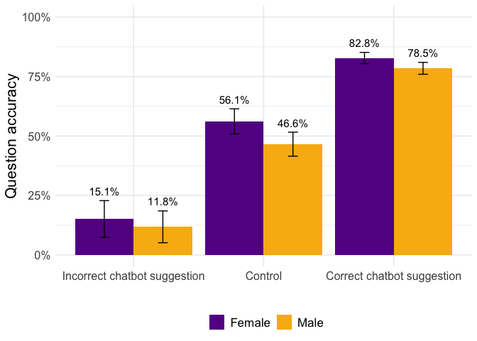<!-- -->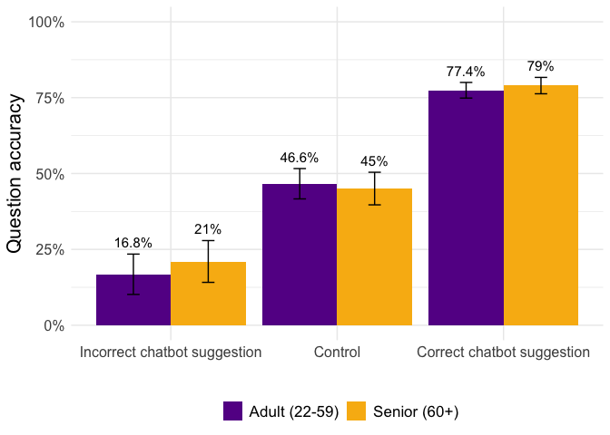<!-- -->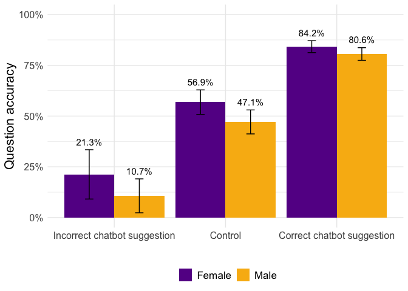<!-- -->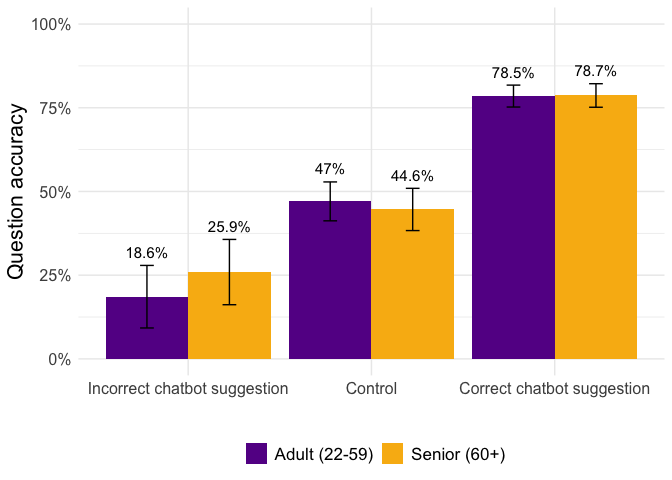<!-- -->

# Figure 11

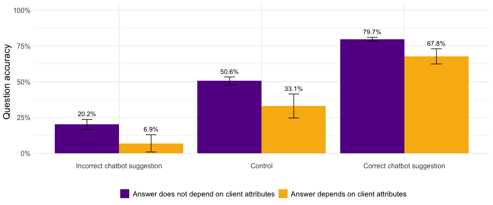<!-- -->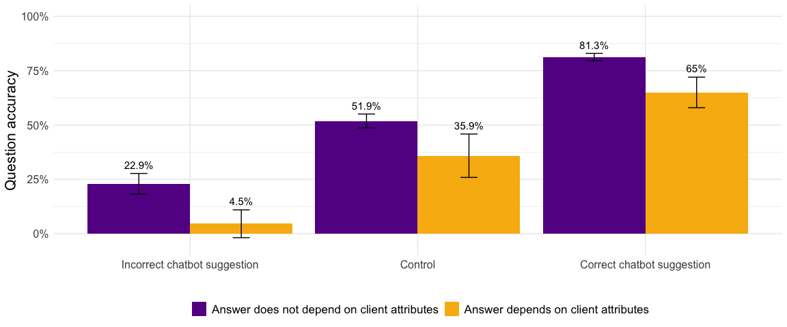<!-- -->

# Figures 13-14

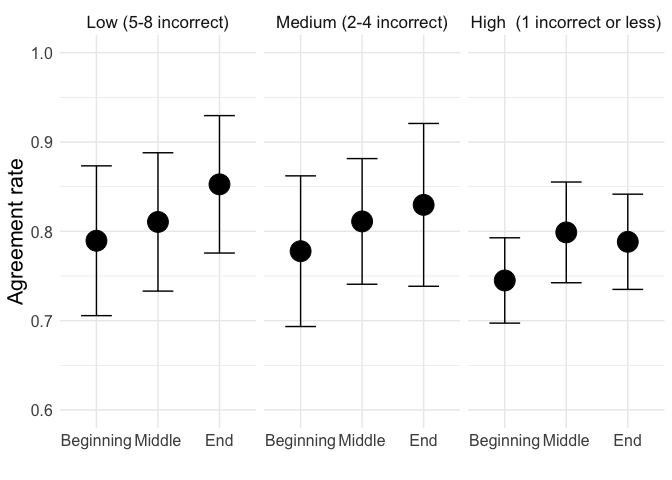<!-- -->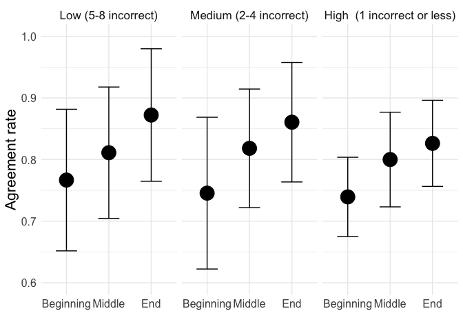<!-- -->

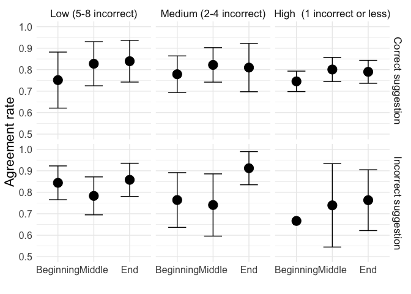<!-- -->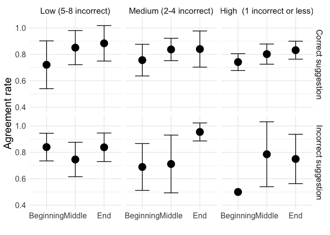<!-- -->

# Figure 15

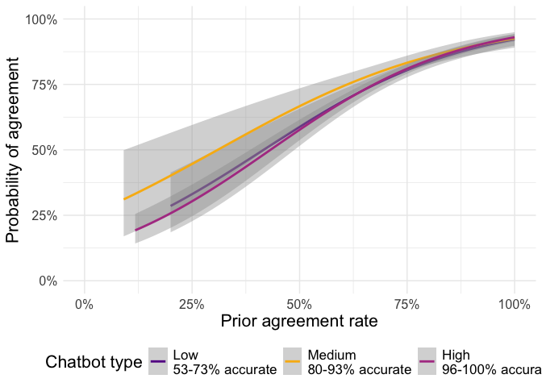<!-- -->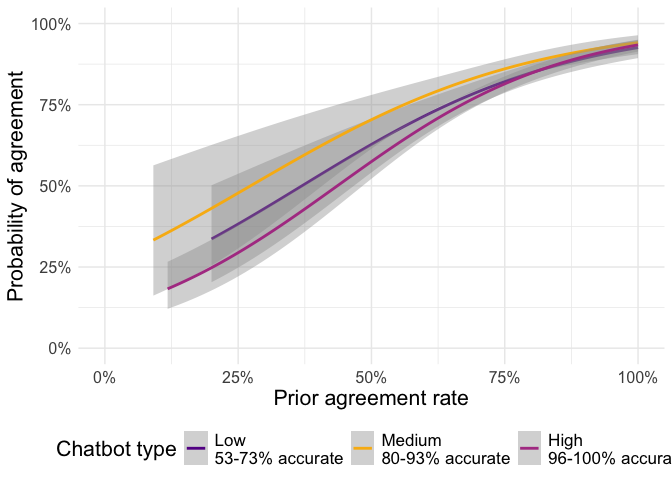<!-- -->

# Figure 16: accuracy by question position

# Figure 17

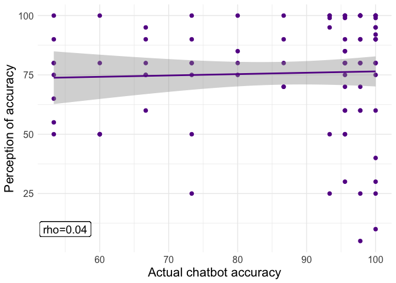<!-- -->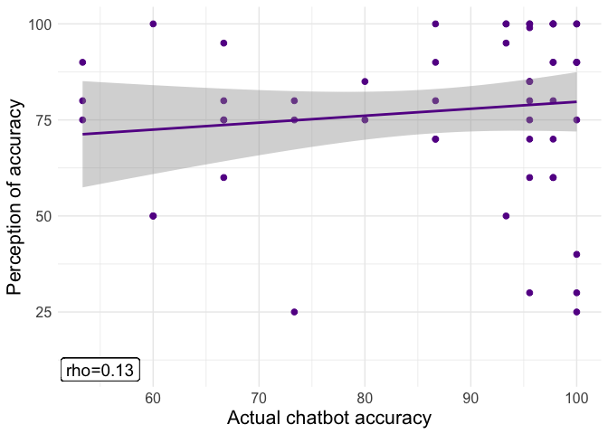<!-- -->

# Regression Tables

## Tables 15-20

### Simple linear models

    ## 
    ## =============================================================================================================================
    ##                                                                       Dependent variable:                                    
    ##                                   -------------------------------------------------------------------------------------------
    ##                                                                       respondent_correct                                     
    ##                                                           OLS                                   panel              linear   
    ##                                                                                                linear           mixed-effects
    ##                                              (1)                       (2)                (3)          (4)           (5)     
    ## -----------------------------------------------------------------------------------------------------------------------------
    ## llm_incorrect                             -0.305***                 -0.542***          -0.550***    -0.501***     -0.511***  
    ##                                            (0.025)                   (0.068)            (0.069)      (0.051)       (0.051)   
    ##                                                                                                                              
    ## llm_correct                               0.297***                   0.061*              0.061*      0.058**       0.058**   
    ##                                            (0.025)                   (0.031)            (0.031)      (0.020)       (0.020)   
    ##                                                                                                                              
    ## chatbot_accuracy                                                     -0.0001            -0.0001      -0.0001       -0.0001   
    ##                                                                      (0.001)            (0.001)      (0.0005)     (0.0005)   
    ##                                                                                                                              
    ## difficulty_recoded2                                                 -0.289***          -0.288***    -0.292***     -0.290***  
    ##                                                                      (0.025)            (0.025)      (0.026)       (0.026)   
    ##                                                                                                                              
    ## difficulty_recoded3                                                 -0.615***          -0.615***    -0.617***     -0.616***  
    ##                                                                      (0.025)            (0.025)      (0.027)       (0.027)   
    ##                                                                                                                              
    ## llm_correct:difficulty_recoded2                                     0.207***            0.209***     0.209***     0.212***   
    ##                                                                      (0.028)            (0.028)      (0.025)       (0.025)   
    ##                                                                                                                              
    ## llm_correct:difficulty_recoded3                                     0.400***            0.400***     0.405***     0.404***   
    ##                                                                      (0.032)            (0.032)      (0.030)       (0.030)   
    ##                                                                                                                              
    ## llm_incorrect:difficulty_recoded2                                    0.214**            0.217**       0.174*       0.178*    
    ##                                                                      (0.068)            (0.070)      (0.083)       (0.083)   
    ##                                                                                                                              
    ## llm_incorrect:difficulty_recoded3                                   0.450***            0.463***     0.400***     0.415***   
    ##                                                                      (0.069)            (0.072)      (0.058)       (0.058)   
    ##                                                                                                                              
    ## Constant                                  0.490***                  0.845***            0.844***     0.850***     0.850***   
    ##                                            (0.017)                   (0.108)            (0.108)      (0.054)       (0.054)   
    ##                                                                                                                              
    ## -----------------------------------------------------------------------------------------------------------------------------
    ## Observations                                5,625                     5,625              5,625        5,625         5,625    
    ## R2                                          0.180                     0.276              0.254        0.272                  
    ## Adjusted R2                                 0.180                     0.275              0.252        0.271                  
    ## Log Likelihood                                                                                                   -2,768.213  
    ## Akaike Inf. Crit.                                                                                                 5,562.425  
    ## Bayesian Inf. Crit.                                                                                               5,648.680  
    ## Residual Std. Error                   0.432 (df = 5622)         0.406 (df = 5615)                                            
    ## F Statistic                       617.636*** (df = 2; 5622) 238.233*** (df = 9; 5615) 1,908.589*** 1,696.412***              
    ## =============================================================================================================================
    ## Note:                                                                                           *p<0.05; **p<0.01; ***p<0.001
    ##  =============================================================================================================================                                                                       Dependent variable:                                                                       -------------------------------------------------------------------------------------------                                                                       respondent_correct                                                                                                OLS                                   panel              linear                                                                                                   linear           mixed-effects                                              (1)                       (2)                (3)          (4)           (5)      ----------------------------------------------------------------------------------------------------------------------------- llm_incorrect                             -0.305***                 -0.542***          -0.550***    -0.501***     -0.511***                                              (0.025)                   (0.068)            (0.069)      (0.051)       (0.051)                                                                                                                                  llm_correct                               0.297***                   0.061*              0.061*      0.058**       0.058**                                               (0.025)                   (0.031)            (0.031)      (0.020)       (0.020)                                                                                                                                  chatbot_accuracy                                                     -0.0001            -0.0001      -0.0001       -0.0001                                                                         (0.001)            (0.001)      (0.0005)     (0.0005)                                                                                                                                  difficulty_recoded2                                                 -0.289***          -0.288***    -0.292***     -0.290***                                                                        (0.025)            (0.025)      (0.026)       (0.026)                                                                                                                                  difficulty_recoded3                                                 -0.615***          -0.615***    -0.617***     -0.616***                                                                        (0.025)            (0.025)      (0.027)       (0.027)                                                                                                                                  llm_correct:difficulty_recoded2                                     0.207***            0.209***     0.209***     0.212***                                                                         (0.028)            (0.028)      (0.025)       (0.025)                                                                                                                                  llm_correct:difficulty_recoded3                                     0.400***            0.400***     0.405***     0.404***                                                                         (0.032)            (0.032)      (0.030)       (0.030)                                                                                                                                  llm_incorrect:difficulty_recoded2                                    0.214**            0.217**       0.174*       0.178*                                                                          (0.068)            (0.070)      (0.083)       (0.083)                                                                                                                                  llm_incorrect:difficulty_recoded3                                   0.450***            0.463***     0.400***     0.415***                                                                         (0.069)            (0.072)      (0.058)       (0.058)                                                                                                                                  Constant                                  0.490***                  0.845***            0.844***     0.850***     0.850***                                               (0.017)                   (0.108)            (0.108)      (0.054)       (0.054)                                                                                                                                  ----------------------------------------------------------------------------------------------------------------------------- Observations                                5,625                     5,625              5,625        5,625         5,625     R2                                          0.180                     0.276              0.254        0.272                   Adjusted R2                                 0.180                     0.275              0.252        0.271                   Log Likelihood                                                                                                   -2,768.213   Akaike Inf. Crit.                                                                                                 5,562.425   Bayesian Inf. Crit.                                                                                               5,648.680   Residual Std. Error                   0.432 (df = 5622)         0.406 (df = 5615)                                             F Statistic                       617.636*** (df = 2; 5622) 238.233*** (df = 9; 5615) 1,908.589*** 1,696.412***               ============================================================================================================================= Note:                                                                                           *p<0.05; **p<0.01; ***p<0.001

    ## 
    ## =========================================================================================================================
    ##                                                                     Dependent variable:                                  
    ##                                   ---------------------------------------------------------------------------------------
    ##                                                                     respondent_correct                                   
    ##                                                           OLS                                 panel           linear  
    ##                                                                                              linear         mixed-effects
    ##                                              (1)                       (2)               (3)        (4)          (5)     
    ## -------------------------------------------------------------------------------------------------------------------------
    ## llm_incorrect                             -0.195***                 -0.449***         -0.451***  -0.444***    -0.445***  
    ##                                            (0.026)                   (0.083)           (0.084)    (0.059)      (0.059)   
    ##                                                                                                                          
    ## llm_correct                               0.348***                    0.105             0.111     0.094***    0.100***   
    ##                                            (0.029)                   (0.063)           (0.061)    (0.021)      (0.021)   
    ##                                                                                                                          
    ## chatbot_accuracy                                                     0.0001             0.0002    -0.0002      -0.0002   
    ##                                                                      (0.001)           (0.001)    (0.001)      (0.001)   
    ##                                                                                                                          
    ## difficulty_recoded2                                                 -0.211***         -0.208***  -0.215***    -0.213***  
    ##                                                                      (0.047)           (0.045)    (0.049)      (0.049)   
    ##                                                                                                                          
    ## difficulty_recoded3                                                 -0.526***         -0.525***  -0.529***    -0.528***  
    ##                                                                      (0.052)           (0.051)    (0.047)      (0.047)   
    ##                                                                                                                          
    ## llm_correct:difficulty_recoded2                                      0.148**           0.142**    0.160***    0.154***   
    ##                                                                      (0.057)           (0.054)    (0.029)      (0.029)   
    ##                                                                                                                          
    ## llm_correct:difficulty_recoded3                                     0.349***           0.341***   0.361***    0.354***   
    ##                                                                      (0.065)           (0.062)    (0.036)      (0.036)   
    ##                                                                                                                          
    ## llm_incorrect:difficulty_recoded2                                     0.137             0.135      0.114        0.112    
    ##                                                                      (0.078)           (0.079)    (0.090)      (0.090)   
    ##                                                                                                                          
    ## llm_incorrect:difficulty_recoded3                                   0.362***           0.367***   0.337***    0.341***   
    ##                                                                      (0.082)           (0.082)    (0.065)      (0.065)   
    ##                                                                                                                          
    ## Constant                                  0.380***                  0.736***           0.733***   0.769***    0.767***   
    ##                                            (0.019)                   (0.117)           (0.116)    (0.083)      (0.083)   
    ##                                                                                                                          
    ## -------------------------------------------------------------------------------------------------------------------------
    ## Observations                                2,994                     2,994             2,994      2,994        2,994    
    ## R2                                          0.204                     0.251             0.199      0.244                 
    ## Adjusted R2                                 0.203                     0.249             0.197      0.241                 
    ## Log Likelihood                                                                                               -1,693.786  
    ## Akaike Inf. Crit.                                                                                             3,413.571  
    ## Bayesian Inf. Crit.                                                                                           3,491.628  
    ## Residual Std. Error                   0.445 (df = 2991)         0.432 (df = 2984)                                        
    ## F Statistic                       382.820*** (df = 2; 2991) 110.972*** (df = 9; 2984) 741.499*** 925.596***              
    ## =========================================================================================================================
    ## Note:                                                                                       *p<0.05; **p<0.01; ***p<0.001
    ##  =========================================================================================================================                                                                     Dependent variable:                                                                     ---------------------------------------------------------------------------------------                                                                     respondent_correct                                                                                              OLS                                 panel           linear                                                                                                linear         mixed-effects                                              (1)                       (2)               (3)        (4)          (5)      ------------------------------------------------------------------------------------------------------------------------- llm_incorrect                             -0.195***                 -0.449***         -0.451***  -0.444***    -0.445***                                              (0.026)                   (0.083)           (0.084)    (0.059)      (0.059)                                                                                                                              llm_correct                               0.348***                    0.105             0.111     0.094***    0.100***                                               (0.029)                   (0.063)           (0.061)    (0.021)      (0.021)                                                                                                                              chatbot_accuracy                                                     0.0001             0.0002    -0.0002      -0.0002                                                                         (0.001)           (0.001)    (0.001)      (0.001)                                                                                                                              difficulty_recoded2                                                 -0.211***         -0.208***  -0.215***    -0.213***                                                                        (0.047)           (0.045)    (0.049)      (0.049)                                                                                                                              difficulty_recoded3                                                 -0.526***         -0.525***  -0.529***    -0.528***                                                                        (0.052)           (0.051)    (0.047)      (0.047)                                                                                                                              llm_correct:difficulty_recoded2                                      0.148**           0.142**    0.160***    0.154***                                                                         (0.057)           (0.054)    (0.029)      (0.029)                                                                                                                              llm_correct:difficulty_recoded3                                     0.349***           0.341***   0.361***    0.354***                                                                         (0.065)           (0.062)    (0.036)      (0.036)                                                                                                                              llm_incorrect:difficulty_recoded2                                     0.137             0.135      0.114        0.112                                                                          (0.078)           (0.079)    (0.090)      (0.090)                                                                                                                              llm_incorrect:difficulty_recoded3                                   0.362***           0.367***   0.337***    0.341***                                                                         (0.082)           (0.082)    (0.065)      (0.065)                                                                                                                              Constant                                  0.380***                  0.736***           0.733***   0.769***    0.767***                                               (0.019)                   (0.117)           (0.116)    (0.083)      (0.083)                                                                                                                              ------------------------------------------------------------------------------------------------------------------------- Observations                                2,994                     2,994             2,994      2,994        2,994     R2                                          0.204                     0.251             0.199      0.244                  Adjusted R2                                 0.203                     0.249             0.197      0.241                  Log Likelihood                                                                                               -1,693.786   Akaike Inf. Crit.                                                                                             3,413.571   Bayesian Inf. Crit.                                                                                           3,491.628   Residual Std. Error                   0.445 (df = 2991)         0.432 (df = 2984)                                         F Statistic                       382.820*** (df = 2; 2991) 110.972*** (df = 9; 2984) 741.499*** 925.596***               ========================================================================================================================= Note:                                                                                       *p<0.05; **p<0.01; ***p<0.001

    ## 
    ## ========================================================================================================================
    ##                                                                    Dependent variable:                                  
    ##                                   --------------------------------------------------------------------------------------
    ##                                                                     respondent_correct                                  
    ##                                                          OLS                                 panel           linear  
    ##                                                                                             linear         mixed-effects
    ##                                              (1)                      (2)               (3)        (4)          (5)     
    ## ------------------------------------------------------------------------------------------------------------------------
    ## llm_incorrect                             -0.184***                -0.567***         -0.577***  -0.575***    -0.586***  
    ##                                            (0.034)                  (0.097)           (0.098)    (0.102)      (0.102)   
    ##                                                                                                                         
    ## llm_correct                               0.342***                   0.085             0.088      0.078        0.082    
    ##                                            (0.037)                  (0.078)           (0.076)    (0.043)      (0.043)   
    ##                                                                                                                         
    ## chatbot_accuracy                                                     -0.001            -0.001     -0.001      -0.001    
    ##                                                                     (0.001)           (0.001)    (0.001)      (0.001)   
    ##                                                                                                                         
    ## difficulty_recoded2                                                -0.226***         -0.226***  -0.230***    -0.228***  
    ##                                                                     (0.058)           (0.058)    (0.068)      (0.068)   
    ##                                                                                                                         
    ## difficulty_recoded3                                                -0.559***         -0.558***  -0.560***    -0.558***  
    ##                                                                     (0.061)           (0.060)    (0.062)      (0.062)   
    ##                                                                                                                         
    ## llm_correct:difficulty_recoded2                                      0.142*            0.140*    0.150**      0.148**   
    ##                                                                     (0.071)           (0.068)    (0.057)      (0.057)   
    ##                                                                                                                         
    ## llm_correct:difficulty_recoded3                                     0.362***          0.360***   0.368***    0.365***   
    ##                                                                     (0.079)           (0.076)    (0.052)      (0.052)   
    ##                                                                                                                         
    ## llm_incorrect:difficulty_recoded2                                   0.258**           0.270**     0.238        0.250    
    ##                                                                     (0.091)           (0.091)    (0.140)      (0.140)   
    ##                                                                                                                         
    ## llm_incorrect:difficulty_recoded3                                   0.459***          0.470***   0.437***    0.447***   
    ##                                                                     (0.098)           (0.097)    (0.106)      (0.106)   
    ##                                                                                                                         
    ## Constant                                  0.390***                  0.867***          0.863***   0.915***    0.914***   
    ##                                            (0.023)                  (0.150)           (0.148)    (0.120)      (0.120)   
    ##                                                                                                                         
    ## ------------------------------------------------------------------------------------------------------------------------
    ## Observations                                1,890                    1,890             1,890      1,890        1,890    
    ## R2                                          0.187                    0.243             0.204      0.243                 
    ## Adjusted R2                                 0.186                    0.240             0.200      0.239                 
    ## Log Likelihood                                                                                              -1,092.739  
    ## Akaike Inf. Crit.                                                                                            2,211.479  
    ## Bayesian Inf. Crit.                                                                                          2,283.555  
    ## Residual Std. Error                   0.450 (df = 1887)        0.435 (df = 1880)                                        
    ## F Statistic                       216.355*** (df = 2; 1887) 67.195*** (df = 9; 1880) 481.264*** 578.627***              
    ## ========================================================================================================================
    ## Note:                                                                                      *p<0.05; **p<0.01; ***p<0.001
    ##  ========================================================================================================================                                                                    Dependent variable:                                                                     --------------------------------------------------------------------------------------                                                                     respondent_correct                                                                                            OLS                                 panel           linear                                                                                               linear         mixed-effects                                              (1)                      (2)               (3)        (4)          (5)      ------------------------------------------------------------------------------------------------------------------------ llm_incorrect                             -0.184***                -0.567***         -0.577***  -0.575***    -0.586***                                              (0.034)                  (0.097)           (0.098)    (0.102)      (0.102)                                                                                                                             llm_correct                               0.342***                   0.085             0.088      0.078        0.082                                                (0.037)                  (0.078)           (0.076)    (0.043)      (0.043)                                                                                                                             chatbot_accuracy                                                     -0.001            -0.001     -0.001      -0.001                                                                         (0.001)           (0.001)    (0.001)      (0.001)                                                                                                                             difficulty_recoded2                                                -0.226***         -0.226***  -0.230***    -0.228***                                                                       (0.058)           (0.058)    (0.068)      (0.068)                                                                                                                             difficulty_recoded3                                                -0.559***         -0.558***  -0.560***    -0.558***                                                                       (0.061)           (0.060)    (0.062)      (0.062)                                                                                                                             llm_correct:difficulty_recoded2                                      0.142*            0.140*    0.150**      0.148**                                                                        (0.071)           (0.068)    (0.057)      (0.057)                                                                                                                             llm_correct:difficulty_recoded3                                     0.362***          0.360***   0.368***    0.365***                                                                        (0.079)           (0.076)    (0.052)      (0.052)                                                                                                                             llm_incorrect:difficulty_recoded2                                   0.258**           0.270**     0.238        0.250                                                                         (0.091)           (0.091)    (0.140)      (0.140)                                                                                                                             llm_incorrect:difficulty_recoded3                                   0.459***          0.470***   0.437***    0.447***                                                                        (0.098)           (0.097)    (0.106)      (0.106)                                                                                                                             Constant                                  0.390***                  0.867***          0.863***   0.915***    0.914***                                               (0.023)                  (0.150)           (0.148)    (0.120)      (0.120)                                                                                                                             ------------------------------------------------------------------------------------------------------------------------ Observations                                1,890                    1,890             1,890      1,890        1,890     R2                                          0.187                    0.243             0.204      0.243                  Adjusted R2                                 0.186                    0.240             0.200      0.239                  Log Likelihood                                                                                              -1,092.739   Akaike Inf. Crit.                                                                                            2,211.479   Bayesian Inf. Crit.                                                                                          2,283.555   Residual Std. Error                   0.450 (df = 1887)        0.435 (df = 1880)                                         F Statistic                       216.355*** (df = 2; 1887) 67.195*** (df = 9; 1880) 481.264*** 578.627***               ======================================================================================================================== Note:                                                                                      *p<0.05; **p<0.01; ***p<0.001

### Generalized linear models

    ## 
    ## ================================================================================================
    ##                                                            Dependent variable:                  
    ##                                           ------------------------------------------------------
    ##                                                             respondent_correct                  
    ##                                                 logistic               generalized linear       
    ##                                                                          mixed-effects          
    ##                                              (1)        (2)        (3)        (4)        (5)    
    ## ------------------------------------------------------------------------------------------------
    ## llm_incorrect                             -1.442***  -2.458***  -2.878***  -2.225***  -2.674*** 
    ##                                            (0.140)    (0.577)    (0.595)    (0.389)    (0.622)  
    ##                                                                                                 
    ## llm_correct                                1.347***    0.598      0.569      0.583*     0.512   
    ##                                            (0.126)    (0.664)    (0.557)    (0.306)    (0.567)  
    ##                                                                                                 
    ## difficulty_recoded2                                  -1.446***  -1.514***  -1.489***  -1.567*** 
    ##                                                       (0.147)    (0.174)    (0.189)    (0.199)  
    ##                                                                                                 
    ## difficulty_recoded3                                  -2.891***  -3.063***  -2.956***  -3.144*** 
    ##                                                       (0.171)    (0.177)    (0.189)    (0.200)  
    ##                                                                                                 
    ## experiment_typecontrol:chatbot_accuracy                                                         
    ##                                                                                                 
    ##                                                                                                 
    ## experiment_typetreatment:chatbot_accuracy              -0.001     0.002      -0.001     0.002   
    ##                                                       (0.007)    (0.006)    (0.003)    (0.006)  
    ##                                                                                                 
    ## llm_correct:difficulty_recoded2                       0.751***   0.776***   0.792***   0.820*** 
    ##                                                       (0.190)    (0.220)    (0.214)    (0.222)  
    ##                                                                                                 
    ## llm_correct:difficulty_recoded3                       1.478***   1.474***   1.540***   1.546*** 
    ##                                                       (0.230)    (0.214)    (0.207)    (0.216)  
    ##                                                                                                 
    ## llm_incorrect:difficulty_recoded2                     1.050***   1.150***   0.790**    0.870**  
    ##                                                       (0.354)    (0.364)    (0.388)    (0.406)  
    ##                                                                                                 
    ## llm_incorrect:difficulty_recoded3                     1.868***   2.098***   1.563***   1.763*** 
    ##                                                       (0.408)    (0.366)    (0.388)    (0.408)  
    ##                                                                                                 
    ## Constant                                    -0.039    1.638***   1.727***   1.694***   1.800*** 
    ##                                            (0.068)    (0.165)    (0.197)    (0.150)    (0.210)  
    ##                                                                                                 
    ## ------------------------------------------------------------------------------------------------
    ## Observations                                5,625      5,625      5,625      5,625      5,625   
    ## Log Likelihood                            -3,133.824 -2,838.605 -2,698.455 -2,825.347 -2,681.837
    ## Akaike Inf. Crit.                         6,273.649  5,697.211  5,418.910  5,672.694  5,387.673 
    ## Bayesian Inf. Crit.                                             5,491.894  5,745.679  5,467.293 
    ## ================================================================================================
    ## Note:                                                                *p<0.1; **p<0.05; ***p<0.01
    ##  ================================================================================================                                                            Dependent variable:                                                             ------------------------------------------------------                                                             respondent_correct                                                                   logistic               generalized linear                                                                                 mixed-effects                                                        (1)        (2)        (3)        (4)        (5)     ------------------------------------------------------------------------------------------------ llm_incorrect                             -1.442***  -2.458***  -2.878***  -2.225***  -2.674***                                             (0.140)    (0.577)    (0.595)    (0.389)    (0.622)                                                                                                    llm_correct                                1.347***    0.598      0.569      0.583*     0.512                                               (0.126)    (0.664)    (0.557)    (0.306)    (0.567)                                                                                                    difficulty_recoded2                                  -1.446***  -1.514***  -1.489***  -1.567***                                                        (0.147)    (0.174)    (0.189)    (0.199)                                                                                                    difficulty_recoded3                                  -2.891***  -3.063***  -2.956***  -3.144***                                                        (0.171)    (0.177)    (0.189)    (0.200)                                                                                                    experiment_typecontrol:chatbot_accuracy                                                                                                                                                                                                                                                            experiment_typetreatment:chatbot_accuracy              -0.001     0.002      -0.001     0.002                                                          (0.007)    (0.006)    (0.003)    (0.006)                                                                                                    llm_correct:difficulty_recoded2                       0.751***   0.776***   0.792***   0.820***                                                        (0.190)    (0.220)    (0.214)    (0.222)                                                                                                    llm_correct:difficulty_recoded3                       1.478***   1.474***   1.540***   1.546***                                                        (0.230)    (0.214)    (0.207)    (0.216)                                                                                                    llm_incorrect:difficulty_recoded2                     1.050***   1.150***   0.790**    0.870**                                                         (0.354)    (0.364)    (0.388)    (0.406)                                                                                                    llm_incorrect:difficulty_recoded3                     1.868***   2.098***   1.563***   1.763***                                                        (0.408)    (0.366)    (0.388)    (0.408)                                                                                                    Constant                                    -0.039    1.638***   1.727***   1.694***   1.800***                                             (0.068)    (0.165)    (0.197)    (0.150)    (0.210)                                                                                                    ------------------------------------------------------------------------------------------------ Observations                                5,625      5,625      5,625      5,625      5,625    Log Likelihood                            -3,133.824 -2,838.605 -2,698.455 -2,825.347 -2,681.837 Akaike Inf. Crit.                         6,273.649  5,697.211  5,418.910  5,672.694  5,387.673  Bayesian Inf. Crit.                                             5,491.894  5,745.679  5,467.293  ================================================================================================ Note:                                                                *p<0.1; **p<0.05; ***p<0.01

    ## 
    ## ================================================================================================
    ##                                                            Dependent variable:                  
    ##                                           ------------------------------------------------------
    ##                                                             respondent_correct                  
    ##                                                 logistic               generalized linear       
    ##                                                                          mixed-effects          
    ##                                              (1)        (2)        (3)        (4)        (5)    
    ## ------------------------------------------------------------------------------------------------
    ## llm_incorrect                             -0.993***  -2.018***  -2.288***  -1.866***  -2.120*** 
    ##                                            (0.146)    (0.531)    (0.648)    (0.505)    (0.662)  
    ##                                                                                                 
    ## llm_correct                                1.477***    0.593      0.587      0.678      0.686   
    ##                                            (0.139)    (0.621)    (0.693)    (0.563)    (0.712)  
    ##                                                                                                 
    ## difficulty_recoded2                                  -0.942***  -0.979***  -0.980***  -1.029*** 
    ##                                                       (0.244)    (0.318)    (0.373)    (0.395)  
    ##                                                                                                 
    ## difficulty_recoded3                                  -2.342***  -2.467***  -2.410***  -2.554*** 
    ##                                                       (0.282)    (0.316)    (0.364)    (0.386)  
    ##                                                                                                 
    ## experiment_typecontrol:chatbot_accuracy                                                         
    ##                                                                                                 
    ##                                                                                                 
    ## experiment_typetreatment:chatbot_accuracy              0.001      0.002      -0.001     0.001   
    ##                                                       (0.006)    (0.006)    (0.004)    (0.006)  
    ##                                                                                                 
    ## llm_correct:difficulty_recoded2                        0.509      0.493      0.596      0.598   
    ##                                                       (0.350)    (0.424)    (0.414)    (0.430)  
    ##                                                                                                 
    ## llm_correct:difficulty_recoded3                       1.316***   1.308***   1.425***   1.437*** 
    ##                                                       (0.398)    (0.415)    (0.404)    (0.421)  
    ##                                                                                                 
    ## llm_incorrect:difficulty_recoded2                      0.554      0.601      0.419      0.453   
    ##                                                       (0.398)    (0.448)    (0.445)    (0.462)  
    ##                                                                                                 
    ## llm_incorrect:difficulty_recoded3                     1.329***   1.462***   1.190***   1.306*** 
    ##                                                       (0.455)    (0.448)    (0.443)    (0.461)  
    ##                                                                                                 
    ## Constant                                  -0.488***   1.099***   1.154***   1.126***   1.190*** 
    ##                                            (0.081)    (0.262)    (0.312)    (0.335)    (0.374)  
    ##                                                                                                 
    ## ------------------------------------------------------------------------------------------------
    ## Observations                                2,994      2,994      2,994      2,994      2,994   
    ## Log Likelihood                            -1,747.796 -1,667.018 -1,620.551 -1,653.953 -1,605.092
    ## Akaike Inf. Crit.                         3,501.591  3,354.037  3,263.101  3,329.906  3,234.184 
    ## Bayesian Inf. Crit.                                             3,329.149  3,395.954  3,306.237 
    ## ================================================================================================
    ## Note:                                                                *p<0.1; **p<0.05; ***p<0.01
    ##  ================================================================================================                                                            Dependent variable:                                                             ------------------------------------------------------                                                             respondent_correct                                                                   logistic               generalized linear                                                                                 mixed-effects                                                        (1)        (2)        (3)        (4)        (5)     ------------------------------------------------------------------------------------------------ llm_incorrect                             -0.993***  -2.018***  -2.288***  -1.866***  -2.120***                                             (0.146)    (0.531)    (0.648)    (0.505)    (0.662)                                                                                                    llm_correct                                1.477***    0.593      0.587      0.678      0.686                                               (0.139)    (0.621)    (0.693)    (0.563)    (0.712)                                                                                                    difficulty_recoded2                                  -0.942***  -0.979***  -0.980***  -1.029***                                                        (0.244)    (0.318)    (0.373)    (0.395)                                                                                                    difficulty_recoded3                                  -2.342***  -2.467***  -2.410***  -2.554***                                                        (0.282)    (0.316)    (0.364)    (0.386)                                                                                                    experiment_typecontrol:chatbot_accuracy                                                                                                                                                                                                                                                            experiment_typetreatment:chatbot_accuracy              0.001      0.002      -0.001     0.001                                                          (0.006)    (0.006)    (0.004)    (0.006)                                                                                                    llm_correct:difficulty_recoded2                        0.509      0.493      0.596      0.598                                                          (0.350)    (0.424)    (0.414)    (0.430)                                                                                                    llm_correct:difficulty_recoded3                       1.316***   1.308***   1.425***   1.437***                                                        (0.398)    (0.415)    (0.404)    (0.421)                                                                                                    llm_incorrect:difficulty_recoded2                      0.554      0.601      0.419      0.453                                                          (0.398)    (0.448)    (0.445)    (0.462)                                                                                                    llm_incorrect:difficulty_recoded3                     1.329***   1.462***   1.190***   1.306***                                                        (0.455)    (0.448)    (0.443)    (0.461)                                                                                                    Constant                                  -0.488***   1.099***   1.154***   1.126***   1.190***                                             (0.081)    (0.262)    (0.312)    (0.335)    (0.374)                                                                                                    ------------------------------------------------------------------------------------------------ Observations                                2,994      2,994      2,994      2,994      2,994    Log Likelihood                            -1,747.796 -1,667.018 -1,620.551 -1,653.953 -1,605.092 Akaike Inf. Crit.                         3,501.591  3,354.037  3,263.101  3,329.906  3,234.184  Bayesian Inf. Crit.                                             3,329.149  3,395.954  3,306.237  ================================================================================================ Note:                                                                *p<0.1; **p<0.05; ***p<0.01

    ## 
    ## ================================================================================================
    ##                                                            Dependent variable:                  
    ##                                           ------------------------------------------------------
    ##                                                             respondent_correct                  
    ##                                                 logistic               generalized linear       
    ##                                                                          mixed-effects          
    ##                                              (1)        (2)        (3)        (4)        (5)    
    ## ------------------------------------------------------------------------------------------------
    ## llm_incorrect                             -0.904***  -2.127***  -2.422***  -1.972***  -2.265*** 
    ##                                            (0.184)    (0.695)    (0.829)    (0.666)    (0.846)  
    ##                                                                                                 
    ## llm_correct                                1.453***    1.084      1.039      1.279*     1.253   
    ##                                            (0.175)    (0.784)    (0.895)    (0.754)    (0.917)  
    ##                                                                                                 
    ## difficulty_recoded2                                  -1.064***  -1.114***   -1.092**   -1.144** 
    ##                                                       (0.337)    (0.398)    (0.445)    (0.466)  
    ##                                                                                                 
    ## difficulty_recoded3                                  -2.525***  -2.657***  -2.585***  -2.727*** 
    ##                                                       (0.364)    (0.394)    (0.435)    (0.457)  
    ##                                                                                                 
    ## experiment_typecontrol:chatbot_accuracy                                                         
    ##                                                                                                 
    ##                                                                                                 
    ## experiment_typetreatment:chatbot_accuracy              -0.004     -0.003     -0.007     -0.005  
    ##                                                       (0.008)    (0.008)    (0.006)    (0.008)  
    ##                                                                                                 
    ## llm_correct:difficulty_recoded2                        0.435      0.448      0.497      0.518   
    ##                                                       (0.498)    (0.573)    (0.562)    (0.579)  
    ##                                                                                                 
    ## llm_correct:difficulty_recoded3                       1.309**    1.341**    1.386**    1.430**  
    ##                                                       (0.562)    (0.561)    (0.549)    (0.567)  
    ##                                                                                                 
    ## llm_incorrect:difficulty_recoded2                     1.230**    1.355**    1.119**    1.241**  
    ##                                                       (0.503)    (0.572)    (0.569)    (0.588)  
    ##                                                                                                 
    ## llm_incorrect:difficulty_recoded3                     1.876***   2.050***   1.772***   1.934*** 
    ##                                                       (0.604)    (0.577)    (0.572)    (0.591)  
    ##                                                                                                 
    ## Constant                                  -0.446***   1.308***   1.376***   1.331***   1.401*** 
    ##                                            (0.097)    (0.346)    (0.388)    (0.405)    (0.443)  
    ##                                                                                                 
    ## ------------------------------------------------------------------------------------------------
    ## Observations                                1,890      1,890      1,890      1,890      1,890   
    ## Log Likelihood                            -1,121.282 -1,060.400 -1,036.278 -1,052.887 -1,027.480
    ## Akaike Inf. Crit.                         2,248.565  2,140.800  2,094.557  2,127.774  2,078.961 
    ## Bayesian Inf. Crit.                                             2,155.544  2,188.762  2,145.493 
    ## ================================================================================================
    ## Note:                                                                *p<0.1; **p<0.05; ***p<0.01
    ##  ================================================================================================                                                            Dependent variable:                                                             ------------------------------------------------------                                                             respondent_correct                                                                   logistic               generalized linear                                                                                 mixed-effects                                                        (1)        (2)        (3)        (4)        (5)     ------------------------------------------------------------------------------------------------ llm_incorrect                             -0.904***  -2.127***  -2.422***  -1.972***  -2.265***                                             (0.184)    (0.695)    (0.829)    (0.666)    (0.846)                                                                                                    llm_correct                                1.453***    1.084      1.039      1.279*     1.253                                               (0.175)    (0.784)    (0.895)    (0.754)    (0.917)                                                                                                    difficulty_recoded2                                  -1.064***  -1.114***   -1.092**   -1.144**                                                        (0.337)    (0.398)    (0.445)    (0.466)                                                                                                    difficulty_recoded3                                  -2.525***  -2.657***  -2.585***  -2.727***                                                        (0.364)    (0.394)    (0.435)    (0.457)                                                                                                    experiment_typecontrol:chatbot_accuracy                                                                                                                                                                                                                                                            experiment_typetreatment:chatbot_accuracy              -0.004     -0.003     -0.007     -0.005                                                         (0.008)    (0.008)    (0.006)    (0.008)                                                                                                    llm_correct:difficulty_recoded2                        0.435      0.448      0.497      0.518                                                          (0.498)    (0.573)    (0.562)    (0.579)                                                                                                    llm_correct:difficulty_recoded3                       1.309**    1.341**    1.386**    1.430**                                                         (0.562)    (0.561)    (0.549)    (0.567)                                                                                                    llm_incorrect:difficulty_recoded2                     1.230**    1.355**    1.119**    1.241**                                                         (0.503)    (0.572)    (0.569)    (0.588)                                                                                                    llm_incorrect:difficulty_recoded3                     1.876***   2.050***   1.772***   1.934***                                                        (0.604)    (0.577)    (0.572)    (0.591)                                                                                                    Constant                                  -0.446***   1.308***   1.376***   1.331***   1.401***                                             (0.097)    (0.346)    (0.388)    (0.405)    (0.443)                                                                                                    ------------------------------------------------------------------------------------------------ Observations                                1,890      1,890      1,890      1,890      1,890    Log Likelihood                            -1,121.282 -1,060.400 -1,036.278 -1,052.887 -1,027.480 Akaike Inf. Crit.                         2,248.565  2,140.800  2,094.557  2,127.774  2,078.961  Bayesian Inf. Crit.                                             2,155.544  2,188.762  2,145.493  ================================================================================================ Note:                                                                *p<0.1; **p<0.05; ***p<0.01
